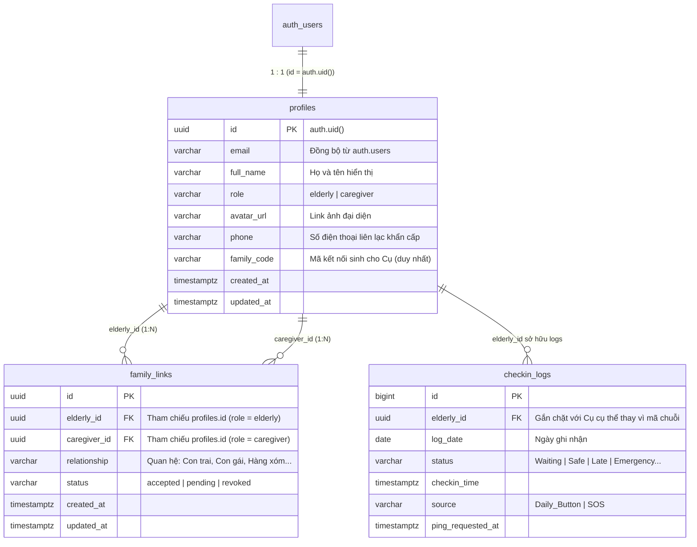
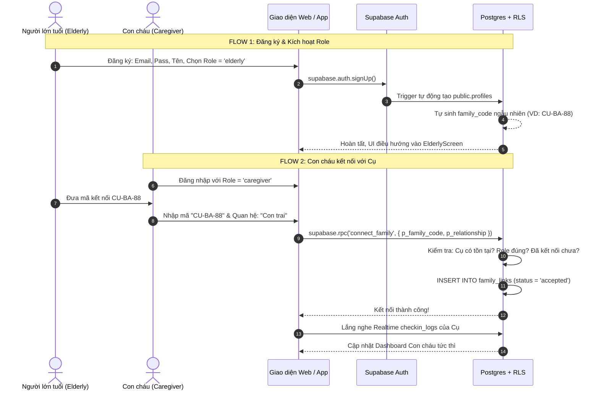

# Product Requirements Document (PRD) Bổ sung: Phân quyền & Quản lý Kết nối Gia đình (Auth & Family Links)

> Tài liệu đặc tả mở rộng cho hệ thống **SafeCheck**, tập trung vào phân tích nghiệp vụ xác thực (Authentication), phân quyền cấp hàng (Row Level Security), và cơ chế ghép nối gia đình (Family Linking) đa người chăm sóc (1:N).

---

## 1. Vấn đề & Mục tiêu Nghiệp vụ (Problem Statement & Objectives)

### 1.1. Vấn đề thực tế
- **Rủi ro rò rỉ dữ liệu cá nhân:** Nếu con cháu chỉ cần tìm kiếm số điện thoại hoặc gõ chung một `family_code` cố định dạng text (`NHA-CU-BA`), bất kỳ ai đoán được mã đều có thể xem giờ giấc sinh hoạt, tình trạng sức khỏe và vị trí của người già.
- **Ranh giới bảo mật lỏng lẻo:** Nếu chỉ dựa vào điều hướng ở Frontend (`if role === 'elderly'`), kẻ xấu có thể can thiệp API request để giả mạo quyền truy cập hoặc tự ý sửa `family_code` trong database.
- **Hạn chế của mô hình mã tĩnh 1-1:** Một người già thường có nhiều người thân cùng chăm sóc (con trai, con dâu, con gái, cháu...). Hệ thống cần hỗ trợ mô hình **1 Cụ - Nhiều Con Cháu (1:N)** với quyền quản lý, duyệt hoặc thu hồi kết nối minh bạch.

### 1.2. Mục tiêu giải pháp
1. **Xác thực phi máy chủ (Serverless Auth):** Tận dụng Supabase Auth chịu trách nhiệm lưu trữ và bảo vệ thông tin xác thực người dùng, đồng thời quản lý phiên làm việc (Session) và mã token an toàn (JWT).
2. **Cơ chế ghép nối an toàn (Pairing Code & RPC):** Dùng mã kết nối động / bảo mật kết hợp hàm xử lý nghiệp vụ (`connect_family`) tại PostgreSQL để xác thực danh tính trước khi thiết lập liên kết.
3. **Bảo mật phân tầng (Defense in Depth):**
   - **Frontend:** Quyết định trải nghiệm UI tương ứng với từng vai trò.
   - **Database (RLS):** Quyết định ranh giới bảo mật thực tế — người dùng chỉ được đọc/ghi đúng dữ liệu mà họ có liên kết hợp lệ (`family_links`).

---

## 2. Đối tượng & Ma trận Phân quyền (User Roles & Permissions)

### 2.1. Danh mục vai trò (`role`)
- **`elderly` (Người lớn tuổi):**
  - Là chủ thể được theo dõi và bảo vệ.
  - Sở hữu hồ sơ sức khỏe, chuỗi điểm danh hàng ngày (`checkin_logs`) và mã kết nối gia đình (`pairing_code`).
  - Có quyền xem danh sách người thân đang liên kết với mình và quyền hủy liên kết khi cần.
- **`caregiver` (Người chăm sóc / Con cháu):**
  - Nhập mã kết nối để xin liên kết với Cụ.
  - Khi được chấp thuận, có quyền theo dõi trạng thái Realtime của Cụ, gửi chuông kiểm tra (Ping), nhận báo động đỏ SOS và giải quyết báo động (`resolve_alarm`).

### 2.2. Ma trận quyền hạn thực tế (RLS Matrix)

| Hành động | `elderly` (Chính chủ) | `caregiver` (Đã liên kết) | `caregiver` (Chưa liên kết / Người lạ) |
| :--- | :---: | :---: | :---: |
| Đọc profile cá nhân | ✅ Toàn quyền | ❌ | ❌ |
| Đọc profile của Cụ | — | ✅ Tên, Avatar, Pin, Trạng thái | ❌ Bị chặn bởi RLS |
| Bấm điểm danh (`perform_checkin`) | ✅ Duy nhất Cụ | ❌ Bị từ chối | ❌ Bị từ chối |
| Kích hoạt SOS (`trigger_sos`) | ✅ Duy nhất Cụ | ❌ Bị từ chối | ❌ Bị từ chối |
| Gửi Ping kiểm tra (`request_ping`) | ❌ | ✅ Được phép | ❌ Bị từ chối |
| Tắt báo động (`resolve_alarm`) | ❌ | ✅ Được phép | ❌ Bị từ chối |
| Xem `checkin_logs` thời gian thực | ✅ Xem của mình | ✅ Chỉ xem Cụ mình liên kết | ❌ Bị chặn hoàn toàn |

---

## 3. Mô hình Dữ liệu Nghiệp vụ (Data Architecture)



### Điểm cải tiến cốt lõi so với thiết kế ban đầu:
1. **Bảng `profiles`**:
   - Thêm `email` (đồng bộ tự động từ `auth.users`).
   - Thêm `avatar_url` (hỗ trợ hiển thị ảnh Cụ và Con cháu, tăng tính nhận diện và ấm cúng cho gia đình).
   - `family_code` chỉ được sinh và gán cho tài khoản có `role = 'elderly'`. Tài khoản `caregiver` không có `family_code` riêng mà kết nối qua `family_links`.
2. **Bảng `family_links` (Quan hệ nhiều-nhiều 1:N)**:
   - Loại bỏ việc ghi đè trực tiếp mã text.
   - Một Cụ có thể có nhiều người thân cùng theo dõi (`status = 'accepted'`).
   - Có thể mở rộng hỗ trợ duyệt lời mời (`pending` $\rightarrow$ `accepted`) hoặc thu hồi quyền truy cập (`revoked`).
3. **Bảng `checkin_logs`**:
   - Khóa ngoại `elderly_id` tham chiếu trực tiếp đến ID của Cụ, đảm bảo tính toàn vẹn dữ liệu thay vì chuỗi string `family_code`.

---

## 4. Các Luồng Nghiệp vụ Chi tiết (Business Flows)



### Flow 1: Đăng ký tài khoản & Trigger hồ sơ tự động
1. Người dùng mở ứng dụng $\rightarrow$ Chọn vai trò: **Tôi là Người lớn tuổi** hoặc **Tôi là Con cháu**.
2. Điền thông tin: Email, Mật khẩu, Họ tên, Số điện thoại.
3. Supabase Auth xử lý đăng ký. 
4. **Database Trigger (`on_auth_user_created`)**:
   - Tự động bắt sự kiện `INSERT` trên `auth.users`.
   - Sao chép `id`, `email` sang bảng `public.profiles`.
   - Nếu `role = 'elderly'`: Tự động gọi hàm phát sinh `family_code` duy nhất (ví dụ gồm tiền tố `SAFE-` + 4 ký tự ngẫu nhiên).

### Flow 2: Cơ chế Kết nối Gia đình an toàn (Pairing Code & RPC)
1. Con cháu sau khi đăng nhập vào Dashboard: Nếu chưa liên kết với ai, màn hình sẽ hiển thị trạng thái chờ: *"Chưa có người thân nào được kết nối"*.
2. Con cháu bấm **"Thêm người thân"** $\rightarrow$ Nhập mã kết nối của Cụ (ví dụ: `SAFE-8821`) và chọn vai trò quan hệ (*Con trai, Con gái, Cháu, Hàng xóm...*).
3. Client **tuyệt đối không chạy lệnh `UPDATE` hay `INSERT` trực tiếp** mà gọi RPC:
   ```sql
   supabase.rpc('connect_family', { p_family_code: 'SAFE-8821', p_relationship: 'Con trai' })
   ```
4. **Hàm Postgres `connect_family` thực thi:**
   - Xác thực người gọi: Phải có phiên đăng nhập hợp lệ (`auth.uid()`).
   - Kiểm tra vai trò: Người gọi phải có role là `caregiver`.
   - Tìm kiếm Cụ sở hữu mã `p_family_code` (role phải là `elderly`).
   - Chặn tự kết nối với chính mình hoặc kết nối trùng lặp.
   - Thêm bản ghi mới vào `family_links` với `status = 'accepted'`.
   - Trả về kết quả: `{ success: true, elderly_name: 'Cụ Ba', message: 'Kết nối thành công' }`.

### Flow 3: Truy cập dữ liệu theo RLS (Security Boundary)
- Khi Con cháu truy vấn `checkin_logs`:
  ```sql
  CREATE POLICY "Caregivers only view linked elderly logs"
  ON checkin_logs FOR SELECT
  USING (
    EXISTS (
      SELECT 1 FROM family_links
      WHERE family_links.caregiver_id = auth.uid()
        AND family_links.elderly_id = checkin_logs.elderly_id
        AND family_links.status = 'accepted'
    )
  );
  ```
- **Ý nghĩa bảo mật:** Dù kẻ xấu có hack được code frontend của con cháu để gửi query đọc trộm dữ liệu của cụ khác, PostgreSQL sẽ tự động từ chối và trả về kết quả rỗng (0 rows) vì không có bản ghi trong `family_links`.

---

## 5. Kế hoạch Triển khai 5 Giai đoạn (Implementation Roadmap)

### 🟢 GIAI ĐOẠN 1: Thiết kế Cơ sở Dữ liệu & Bảo mật (Database & Security)
1. **Migration File v2.0:** `supabase/migrations/20260908000000_auth_family_schema.sql`
   - Tạo bảng `profiles` (bổ sung `email`, `avatar_url`, `family_code`).
   - Tạo bảng `family_links` (quan hệ 1 Cụ - Nhiều Con cháu).
   - Viết Trigger đồng bộ từ `auth.users` sang `profiles`.
   - Viết hàm `generate_family_code()` tự sinh mã cho Cụ.
   - Thiết lập các chính sách bảo mật **Row Level Security (RLS)** nghiêm ngặt.
   - Viết RPC `connect_family(p_family_code, p_relationship)`.

### 🟢 GIAI ĐOẠN 2: Tích hợp Supabase Auth (Authentication Layer)
1. Cấu hình Supabase Client lắng nghe phiên (`onAuthStateChange`).
2. Viết dịch vụ xác thực: Đăng ký kèm Metadata (Role, Full Name, Phone), Đăng nhập, Đăng xuất.

### 🟢 GIAI ĐOẠN 3: Điều phối Giao diện React theo Role (Role-based Routing)
1. Tạo component `AuthScreen.tsx`: Giao diện Đăng nhập/Đăng ký với 2 nút chọn Role cực kỳ trực quan.
2. Cập nhật `App.tsx`:
   - Trạng thái chưa đăng nhập $\rightarrow$ Hiển thị `AuthScreen`.
   - Đăng nhập `role === 'elderly'` $\rightarrow$ Render toàn màn hình `ElderlyScreen`.
   - Đăng nhập `role === 'caregiver'` $\rightarrow$ Render `CaregiverScreen` kèm thông tin tài khoản và nút Đăng xuất.

### 🟢 GIAI ĐOẠN 4: Tính năng Kết nối & Đồng bộ Realtime (Family Pairing Flow)
1. Màn hình Cụ: Hiển thị mã kết nối gia đình nổi bật để Cụ/người hỗ trợ dễ đọc cho con cháu.
2. Dashboard Con cháu: Thêm Modal "Kết nối với Cụ" (nhập mã kết nối + chọn quan hệ).
3. Đăng ký Realtime theo `elderly_id` của Cụ đã kết nối.

### 🟢 GIAI ĐOẠN 5: Kiểm thử Toàn diện & Xác thực Bảo mật (Testing & Verification)
1. Kiểm tra kịch bản đăng ký Cụ $\rightarrow$ sinh mã kết nối.
2. Kiểm tra kịch bản Con cháu nhập mã $\rightarrow$ RPC liên kết thành công.
3. Kiểm tra bảo mật RLS: Caregiver lạ không thể đọc dữ liệu của Cụ khác.
4. Xử lý kịch bản Cụ chưa có người liên kết bấm SOS (Phương án B):
   - Hiển thị cảnh báo: "Chưa có người thân nào kết nối với máy của Cụ!"
   - Nút bấm quay số trực tiếp: `📞 GỌI NGAY CẤP CỨU 115` (`tel:115`).
   - Nút tắt còi / xác nhận đã ổn: `🟢 TÔI ĐÃ ỔN / TẮT CÒI` (gọi `resolve_alarm`).
5. Chạy `npm run build` xác thực 100% không lỗi biên dịch.

