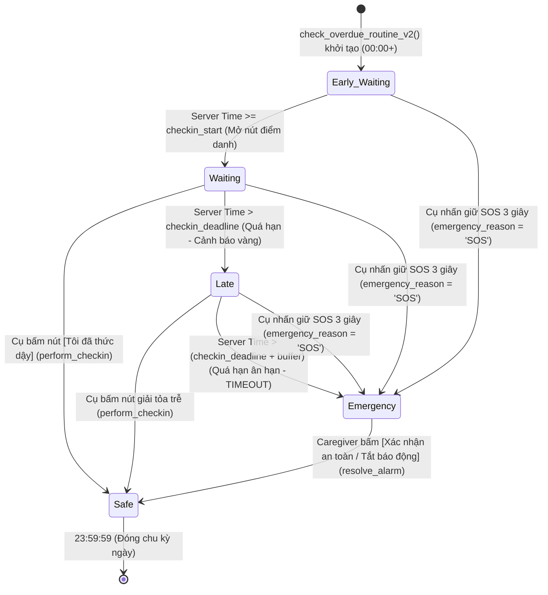

# Product Requirements Document (PRD): Quản lý Khung giờ Điểm danh & Chuỗi Bản ghi Lịch sử (Custom Check-in Schedule & Persistent Daily History)

> **Mã tài liệu:** `PRD_CHECKIN_SCHEDULE.md`  
> **Dự án:** SafeCheck - Hệ thống Điểm danh & Cứu hộ Người cao tuổi  
> **Phiên bản:** v1.2 (Signed-off Production Architecture & Execution Baseline)  
> **Trạng thái:** Đã hoàn thiện toàn bộ Invariant - Sẵn sàng thực thi Migration Phase 1  
> **Hệ quy chiếu chuẩn:** Thực thể người cao tuổi `elderly_id` (UUID), bảng cấu hình lịch `checkin_schedules` gắn theo từng Cụ, bảng nhật ký điểm danh theo ngày `checkin_logs` đóng vai trò Source of Truth lịch sử cho Analytics.  
> **Tài liệu tham chiếu:** [`PRD.md`](file:///c:/Users/lhp14/learn_afterUni/SafeCheck/PRD.md), [`PRD_AUTH_FAMILY.md`](file:///c:/Users/lhp14/learn_afterUni/SafeCheck/PRD_AUTH_FAMILY.md), [`PRD_SOS.md`](file:///c:/Users/lhp14/learn_afterUni/SafeCheck/PRD_SOS.md), [`PRD_Deep_v1.md`](file:///c:/Users/lhp14/learn_afterUni/SafeCheck/PRD_Deep_v1.md)

---

## 1. Tầm nhìn, Bối cảnh & Các Bất Biến Kỹ Thuật Cốt Lõi (Core Invariants)

### 1.1. Cụm tính năng liên hoàn (The Check-in System Cluster)
Hệ thống điểm danh của SafeCheck không cấu thành từ các tính năng rời rạc, mà vận hành theo chuỗi giá trị khép kín:

```
[ Custom Schedule ] ──(thiết lập mốc giờ)──> [ Daily Check-in Execution ]
                                                        │
                                                 (ghi nhận bền vững)
                                                        ▼
[ Anomaly Observation ] ◄──(phân tích thói quen)── [ Check-in History & Analytics ]
```

* **Custom Check-in Schedule:** Cho phép gia đình tùy biến nhịp sinh hoạt đặc thù của từng Cụ (1 lần/ngày lúc thức dậy).
* **Persistent Daily Record:** Mỗi ngày là một bản ghi trong CSDL, lưu giữ mốc giờ kế hoạch (snapshot) và mốc giờ thực tế.
* **History & Analytics:** Nền tảng tổng hợp dữ liệu (Lịch trực quan, tỷ lệ an tâm, giờ trung bình, chuỗi liên tiếp).
* **Anomaly Observation:** Quan sát sự thay đổi hành vi dựa trên số liệu khách quan (**tuyệt đối không đưa ra kết luận/chẩn đoán y khoa suy diễn**).

### 1.2. 9 Bất biến kỹ thuật bắt buộc (Strict Engineering Invariants)

| STT | Bất biến kỹ thuật | Quy định thực thi chi tiết |
| :---: | :--- | :--- |
| **1** | **Khởi tạo dữ liệu ngày mới (Daily Log Materialization)** | Hàm `check_overdue_routine_v2()` **tự động INSERT khởi tạo bản ghi ngày hôm nay** (`ON CONFLICT DO NOTHING`) cho toàn bộ Cụ có active schedule/profile trước khi thực hiện quét chuyển trạng thái. Bảo đảm dù không có ai mở app, hệ thống vẫn tự động phát hiện trễ giờ/khẩn cấp từ ngày thứ 2 trở đi. |
| **2** | **Công thức kiểm tra tràn ngày (Day Boundary Validation)** | Sử dụng công thức Epoch giây thống nhất giữa DB Constraint, RPC và Frontend: `EXTRACT(EPOCH FROM checkin_deadline) + emergency_buffer_minutes * 60 < 86400` (86,400 giây = 24 giờ). Tránh hoàn toàn lỗi tràn qua `00:00` của kiểu dữ liệu `TIME`. Test biên: `23:30 + 30m` $\rightarrow$ hợp lệ; `23:30 + 31m` $\rightarrow$ không hợp lệ. |
| **3** | **Enforce Snapshot Immutability đa tầng** | Được bảo vệ ở cấp CSDL bằng Trigger `enforce_checkin_log_immutability()`: Cấm sửa log quá khứ (`log_date < today`). Đối với log hôm nay, nếu đã đạt `Safe` hoặc `Emergency`, cấm tuyệt đối thay đổi các cột snapshot (`scheduled_start`, `scheduled_deadline`, `buffer_minutes`). |
| **4** | **Server Time là nguồn xác thực duy nhất (No Client Time)** | Server time (`now() AT TIME ZONE 'Asia/Ho_Chi_Minh'`) là căn cứ duy nhất để quyết định `TOO_EARLY`, `Waiting`, `Late` và `Emergency`. Bỏ hoàn toàn tham số client time khỏi RPC Phase 1 để tránh contract nửa vời; chỉ xem xét khi làm Offline Sync độc lập. |
| **5** | **Dynamic Cron thuộc Phase 1** | Hàm quét quá hạn `check_overdue_routine_v2()` bắt buộc triển khai ngay trong Phase 1 cùng lúc với `checkin_schedules`. Tuyệt đối không để xảy ra tình trạng UI/DB đã đổi giờ nhưng Cron server vẫn chạy theo giờ cứng 09:00 cũ. |
| **6** | **Tách biệt nguyên nhân Emergency & Audit xuyên suốt** | Toàn bộ các luồng chuyển trạng thái đều cập nhật metadata: `check_overdue` set `emergency_reason = 'TIMEOUT'`, `emergency_triggered_at = now()`; luồng SOS set `emergency_reason = 'SOS'`; luồng `resolve_alarm` set `resolved_at = now()`, `resolved_by = auth.uid()`. |
| **7** | **Chặn Elderly đảo ngược `Emergency -> Safe`** | Khi trạng thái ngày hôm nay đã là `Emergency`, Cụ bấm nút điểm danh thông thường **sẽ bị từ chối** (`STATE_IN_EMERGENCY`). Chỉ duy nhất luồng `resolve_alarm` của Caregiver hoặc xác minh khẩn cấp mới được phép giải tỏa báo động về `Safe`. |
| **8** | **RLS Chặn DELETE & Khóa Client Mutation** | `checkin_schedules` chỉ cấp quyền `SELECT`, `INSERT`, `UPDATE` cho Caregiver liên kết; **chặn hoàn toàn `DELETE`**. `checkin_logs` chỉ cấp quyền `SELECT` cho Elderly và Caregiver; toàn bộ `INSERT/UPDATE` trực tiếp từ client bị cấm, chỉ thực thi qua RPC SECURITY DEFINER. |
| **9** | **Khóa cứng Múi giờ Phase 1 (`Asia/Ho_Chi_Minh`)** | Không tạo "ảo giác cấu hình múi giờ" cho người dùng khi chưa hỗ trợ multi-timezone. Múi giờ được khóa cứng là `Asia/Ho_Chi_Minh` (UTC+7) trên toàn bộ CSDL, RPC và Cron. |

---

## 2. Hệ Thống Trạng Thái Điểm Danh (Finite State Machine - FSM)

### 2.1. Chu trình chuyển dịch trạng thái theo thời gian thực



> **Lưu ý nghiệp vụ cốt lõi:**  
> Khi ở trạng thái `Emergency`, mũi tên quay về `Safe` **CHỈ CÓ DUY NHẤT** từ hành động của Caregiver (`resolve_alarm`). Hàm `perform_checkin` của Cụ bị vô hiệu hóa để bảo đảm con cháu đã trực tiếp liên lạc hoặc có mặt kiểm tra tình trạng thực tế của Cụ.

### 2.2. Bảng ma trận chuyển dịch trạng thái theo thời gian

| Mốc thời gian ($T_{server}$) | Trạng thái hiển thị | Giao diện Máy Cụ (`ElderlyScreen`) | Giao diện Con Cháu (`CaregiverScreen`) | Hành động khả dụng của Cụ |
| :--- | :---: | :--- | :--- | :--- |
| **$T < \text{checkin\_start}$** | `Early_Waiting` *(Chưa đến giờ)* | Khóa nút điểm danh. Hiển thị: *"Chưa đến giờ điểm danh. Cụ có thể điểm danh từ [HH:mm]"*. | Huy hiệu Xám: *"Chờ đến giờ điểm danh ([HH:mm])"*. | Nút SOS duy trì 24/7. Nút điểm danh disabled. |
| **$\text{checkin\_start} \le T \le \text{checkin\_deadline}$** | `Waiting` *(Đã đến giờ)* | Mở nút xanh lớn trung tâm: *"Chào buổi sáng, Cụ! Đã đến giờ điểm danh."* kèm nút **[ TÔI ĐÃ THỨC DẬY ]**. | Huy hiệu Vàng nhạt: *"Đang đợi Cụ thức dậy điểm danh (Hạn chót [HH:mm])"*. | Chạm 1 chạm để xác nhận an toàn (`Safe`). |
| **$\text{checkin\_deadline} < T \le \text{checkin\_deadline} + \text{buffer}$** | `Late` *(Trễ giờ)* | Nút chuyển màu Hổ phách/Cam: *"Cụ đang điểm danh hơi muộn. Không sao, hãy nhấn nút để báo cho gia đình biết Cụ vẫn ổn."* | Cảnh báo Vàng (Push Notification Mức 1): *"Cụ chưa điểm danh sáng nay. Đã quá hạn [X] phút"*. Nút Ping sẵn sàng. | Vẫn bấm được nút điểm danh để chuyển về `Safe`. |
| **$T > \text{checkin\_deadline} + \text{buffer}$** | `Emergency` *(Khẩn cấp)* | Hú còi báo động tại chỗ, hiển thị thẻ liên hệ viễn thông khẩn cấp (`CellularFallbackCard`). Nút điểm danh bị khóa. | Báo động Đỏ (Push Mức 2 + Siren): Còi hú trên điện thoại con cháu, hiển thị nút gọi 115 và nút tắt báo động. | Nút điểm danh bị khóa; chỉ gọi điện hoặc chờ con cháu xử lý. |
| **Bất kỳ thời điểm nào Cụ đã an toàn** | `Safe` *(Đã an toàn)* | Nền xanh lá an tâm: *"Cụ đã điểm danh an toàn lúc [HH:mm]. Chúc Cụ một ngày vui vẻ!"* | Huy hiệu Xanh lá: *"Đã điểm danh an toàn lúc [HH:mm]"*. | Khóa nút điểm danh (chống bấm trùng lặp). Nút SOS duy trì 24/7. |

---

## 3. Kiến Trúc Dữ Liệu & Phân Quyền Cơ Sở Dữ Liệu (Schema DDL & RLS)

### 3.1. Bảng cấu hình lịch điểm danh: `public.checkin_schedules`

```sql
-- 1. BẢNG CẤU HÌNH LỊCH ĐIỂM DANH THEO TỪNG CỤ
CREATE TABLE IF NOT EXISTS public.checkin_schedules (
  elderly_id UUID PRIMARY KEY REFERENCES public.profiles(id) ON DELETE CASCADE,
  checkin_start TIME NOT NULL DEFAULT '07:00:00',
  checkin_deadline TIME NOT NULL DEFAULT '09:00:00',
  emergency_buffer_minutes INT NOT NULL DEFAULT 30,
  timezone VARCHAR(50) NOT NULL DEFAULT 'Asia/Ho_Chi_Minh',
  is_active BOOLEAN NOT NULL DEFAULT TRUE,
  updated_by UUID REFERENCES public.profiles(id),
  created_at TIMESTAMPTZ DEFAULT now(),
  updated_at TIMESTAMPTZ DEFAULT now(),

  -- Bất biến 2, 7 & 9: Ràng buộc múi giờ & Không tràn ngày qua Epoch
  CONSTRAINT check_timezone_vn CHECK (timezone = 'Asia/Ho_Chi_Minh'),
  CONSTRAINT check_start_before_deadline CHECK (checkin_start < checkin_deadline),
  CONSTRAINT check_valid_buffer CHECK (emergency_buffer_minutes BETWEEN 5 AND 120),
  CONSTRAINT check_no_day_overflow CHECK (
    (EXTRACT(EPOCH FROM checkin_deadline) + (emergency_buffer_minutes * 60)) < 86400
  )
);

CREATE INDEX IF NOT EXISTS idx_checkin_schedules_active 
ON public.checkin_schedules(elderly_id) WHERE is_active = TRUE;

-- Đăng ký Realtime Publication
ALTER PUBLICATION supabase_realtime ADD TABLE public.checkin_schedules;
```

### 3.2. Bảng `public.checkin_logs` & Trigger bảo vệ Snapshot Immutability

```sql
-- 2. ĐẢM BẢO CẤU TRÚC BẢNG CHECKIN_LOGS CHO HISTORY & ANALYTICS
CREATE TABLE IF NOT EXISTS public.checkin_logs (
  id BIGINT GENERATED BY DEFAULT AS IDENTITY PRIMARY KEY,
  elderly_id UUID NOT NULL REFERENCES public.profiles(id) ON DELETE CASCADE,
  family_code VARCHAR(20),
  log_date DATE NOT NULL,
  
  -- Mốc giờ Snapshot của ngày hôm đó
  scheduled_start TIME NOT NULL DEFAULT '07:00:00',
  scheduled_deadline TIME NOT NULL DEFAULT '09:00:00',
  buffer_minutes INT NOT NULL DEFAULT 30,
  
  -- Trạng thái & Kết quả thực tế
  status VARCHAR(20) NOT NULL DEFAULT 'Waiting' 
    CHECK (status IN ('Early_Waiting', 'Waiting', 'Safe', 'Late', 'Emergency', 'Ping_Requested', 'Overdue_Ping')),
  checkin_time TIMESTAMPTZ,
  source VARCHAR(30), -- 'Daily_Button', 'Ping_Response', 'Caregiver_Manual', 'TIMEOUT', 'SOS'
  
  -- Phân loại nguyên nhân Emergency & Nhật ký xử lý
  emergency_reason VARCHAR(30) CHECK (emergency_reason IN ('TIMEOUT', 'SOS', 'OVERDUE_PING')),
  emergency_triggered_at TIMESTAMPTZ,
  resolved_at TIMESTAMPTZ,
  resolved_by UUID REFERENCES public.profiles(id),
  
  ping_requested_at TIMESTAMPTZ,
  created_at TIMESTAMPTZ DEFAULT now(),
  updated_at TIMESTAMPTZ DEFAULT now(),
  
  CONSTRAINT unique_elderly_date UNIQUE (elderly_id, log_date)
);

CREATE INDEX IF NOT EXISTS idx_checkin_logs_analytics 
ON public.checkin_logs(elderly_id, log_date DESC, status);

-- Đăng ký Realtime cho checkin_logs nếu chưa có
DO $$ BEGIN
  IF NOT EXISTS (
    SELECT 1 FROM pg_publication_tables 
    WHERE pubname = 'supabase_realtime' AND tablename = 'checkin_logs'
  ) THEN
    ALTER PUBLICATION supabase_realtime ADD TABLE public.checkin_logs;
  END IF;
END $$;

-- Bất biến 3: Trigger bảo vệ Snapshot Immutability ở tầng DB
CREATE OR REPLACE FUNCTION public.enforce_checkin_log_immutability()
RETURNS TRIGGER AS $$
BEGIN
  -- 1. Cấm sửa log quá khứ
  IF OLD.log_date < (now() AT TIME ZONE 'Asia/Ho_Chi_Minh')::DATE THEN
    RAISE EXCEPTION 'Bảo mật: Bản ghi điểm danh quá khứ là bất biến tuyệt đối (Immutable)!';
  END IF;

  -- 2. Đối với log hôm nay, nếu đã đạt Safe hoặc Emergency, cấm đổi snapshot mốc giờ
  IF OLD.status IN ('Safe', 'Emergency') THEN
    IF NEW.scheduled_start IS DISTINCT FROM OLD.scheduled_start
       OR NEW.scheduled_deadline IS DISTINCT FROM OLD.scheduled_deadline
       OR NEW.buffer_minutes IS DISTINCT FROM OLD.buffer_minutes THEN
      RAISE EXCEPTION 'Bảo mật: Không được phép thay đổi mốc giờ snapshot khi ngày đã Safe hoặc Emergency!';
    END IF;
  END IF;

  RETURN NEW;
END;
$$ LANGUAGE plpgsql;

DROP TRIGGER IF EXISTS tr_enforce_checkin_log_immutability ON public.checkin_logs;
CREATE TRIGGER tr_enforce_checkin_log_immutability
BEFORE UPDATE ON public.checkin_logs
FOR EACH ROW EXECUTE FUNCTION public.enforce_checkin_log_immutability();
```

### 3.3. Ma trận phân quyền hàng (Row Level Security - RLS)

```sql
-- 1. RLS cho checkin_schedules
ALTER TABLE public.checkin_schedules ENABLE ROW LEVEL SECURITY;

CREATE POLICY "Elderly and Caregivers view schedule"
ON public.checkin_schedules FOR SELECT
USING (
  auth.uid() = elderly_id 
  OR EXISTS (
    SELECT 1 FROM public.family_links fl
    WHERE fl.elderly_id = checkin_schedules.elderly_id
      AND fl.caregiver_id = auth.uid()
      AND fl.status = 'accepted'
  )
);

CREATE POLICY "Caregivers insert linked elderly schedule"
ON public.checkin_schedules FOR INSERT
WITH CHECK (
  EXISTS (
    SELECT 1 FROM public.family_links fl
    WHERE fl.elderly_id = checkin_schedules.elderly_id
      AND fl.caregiver_id = auth.uid()
      AND fl.status = 'accepted'
  )
);

CREATE POLICY "Caregivers update linked elderly schedule"
ON public.checkin_schedules FOR UPDATE
USING (
  EXISTS (
    SELECT 1 FROM public.family_links fl
    WHERE fl.elderly_id = checkin_schedules.elderly_id
      AND fl.caregiver_id = auth.uid()
      AND fl.status = 'accepted'
  )
)
WITH CHECK (
  EXISTS (
    SELECT 1 FROM public.family_links fl
    WHERE fl.elderly_id = checkin_schedules.elderly_id
      AND fl.caregiver_id = auth.uid()
      AND fl.status = 'accepted'
  )
);
-- KHÔNG có Policy DELETE -> Cấm hoàn toàn thao tác xóa schedule.

-- 2. Audit & Khóa RLS cho checkin_logs
ALTER TABLE public.checkin_logs ENABLE ROW LEVEL SECURITY;

DROP POLICY IF EXISTS "Elderly view own checkin logs" ON public.checkin_logs;
CREATE POLICY "Elderly view own checkin logs"
ON public.checkin_logs FOR SELECT
USING (auth.uid() = elderly_id);

DROP POLICY IF EXISTS "Caregivers view linked elderly checkin logs" ON public.checkin_logs;
CREATE POLICY "Caregivers view linked elderly checkin logs"
ON public.checkin_logs FOR SELECT
USING (
  EXISTS (
    SELECT 1 FROM public.family_links fl
    WHERE fl.elderly_id = checkin_logs.elderly_id
      AND fl.caregiver_id = auth.uid()
      AND fl.status = 'accepted'
  )
);
-- KHÔNG có Policy INSERT / UPDATE / DELETE trực tiếp từ Client trên checkin_logs.
```

---

## 4. Đặc Tả Các Hàm Xử Lý Nghiệp Vụ Backend (Atomic RPC Functions)

### 4.1. Hàm cập nhật cấu hình: `update_checkin_schedule`

```sql
CREATE OR REPLACE FUNCTION public.update_checkin_schedule(
  p_elderly_id UUID,
  p_start TIME,
  p_deadline TIME,
  p_buffer_minutes INT DEFAULT 30
)
RETURNS JSONB
LANGUAGE plpgsql
SECURITY DEFINER
SET search_path = ''
AS $$
DECLARE
  v_caller_id UUID := auth.uid();
  v_is_authorized BOOLEAN := FALSE;
  v_today DATE;
  v_today_log RECORD;
  v_current_local_time TIME;
  v_new_status VARCHAR;
BEGIN
  -- 1. Kiểm tra xác thực
  IF v_caller_id IS NULL THEN
    RETURN jsonb_build_object('success', false, 'error', 'UNAUTHORIZED', 'message', 'Yêu cầu đăng nhập');
  END IF;

  -- 2. Kiểm tra quyền Caregiver đã kết nối hợp lệ
  SELECT TRUE INTO v_is_authorized
  FROM public.family_links
  WHERE elderly_id = p_elderly_id
    AND caregiver_id = v_caller_id
    AND status = 'accepted';

  IF NOT FOUND OR v_is_authorized IS NOT TRUE THEN
    RETURN jsonb_build_object('success', false, 'error', 'FORBIDDEN', 'message', 'Chỉ người thân đã kết nối mới có quyền đổi giờ');
  END IF;

  -- 3. Kiểm tra tính hợp lệ của thời gian (Bất biến 2)
  IF p_start >= p_deadline THEN
    RETURN jsonb_build_object('success', false, 'error', 'INVALID_RANGE', 'message', 'Giờ bắt đầu phải trước giờ hạn chót');
  END IF;

  IF p_buffer_minutes < 5 OR p_buffer_minutes > 120 THEN
    RETURN jsonb_build_object('success', false, 'error', 'INVALID_BUFFER', 'message', 'Thời gian chờ phải từ 5 đến 120 phút');
  END IF;

  IF (EXTRACT(EPOCH FROM p_deadline) + (p_buffer_minutes * 60)) >= 86400 THEN
    RETURN jsonb_build_object('success', false, 'error', 'DAY_OVERFLOW', 'message', 'Hạn chót cộng thời gian chờ không được vượt quá 23:59 trong ngày');
  END IF;

  -- 4. Ghi đè hoặc tạo mới cấu hình
  INSERT INTO public.checkin_schedules (
    elderly_id, checkin_start, checkin_deadline, emergency_buffer_minutes, timezone, updated_by, updated_at
  )
  VALUES (
    p_elderly_id, p_start, p_deadline, p_buffer_minutes, 'Asia/Ho_Chi_Minh', v_caller_id, now()
  )
  ON CONFLICT (elderly_id) DO UPDATE
  SET checkin_start = EXCLUDED.checkin_start,
      checkin_deadline = EXCLUDED.checkin_deadline,
      emergency_buffer_minutes = EXCLUDED.emergency_buffer_minutes,
      updated_by = EXCLUDED.updated_by,
      updated_at = now();

  -- 5. Xử lý tác động tức thì tới bản ghi hôm nay (Bất biến 3)
  v_today := (now() AT TIME ZONE 'Asia/Ho_Chi_Minh')::DATE;
  v_current_local_time := (now() AT TIME ZONE 'Asia/Ho_Chi_Minh')::TIME;

  SELECT * INTO v_today_log
  FROM public.checkin_logs
  WHERE elderly_id = p_elderly_id AND log_date = v_today;

  IF FOUND THEN
    -- Nếu Cụ ĐÃ Safe hoặc ĐANG trong báo động Emergency -> KHÔNG ĐỔI SNAPSHOT
    IF v_today_log.status NOT IN ('Safe', 'Emergency') THEN
      IF v_current_local_time < p_start THEN
        v_new_status := 'Early_Waiting';
      ELSIF v_current_local_time <= p_deadline THEN
        v_new_status := 'Waiting';
      ELSIF v_current_local_time <= (p_deadline + (p_buffer_minutes || ' minutes')::INTERVAL) THEN
        v_new_status := 'Late';
      ELSE
        v_new_status := 'Emergency';
      END IF;

      UPDATE public.checkin_logs
      SET scheduled_start = p_start,
          scheduled_deadline = p_deadline,
          buffer_minutes = p_buffer_minutes,
          status = v_new_status,
          emergency_reason = CASE WHEN v_new_status = 'Emergency' THEN 'TIMEOUT' ELSE emergency_reason END,
          emergency_triggered_at = CASE WHEN v_new_status = 'Emergency' THEN now() ELSE emergency_triggered_at END,
          updated_at = now()
      WHERE id = v_today_log.id;
    END IF;
  ELSE
    -- Chưa có bản ghi hôm nay -> Khởi tạo sẵn bản ghi
    IF v_current_local_time < p_start THEN
      v_new_status := 'Early_Waiting';
    ELSIF v_current_local_time <= p_deadline THEN
      v_new_status := 'Waiting';
    ELSE
      v_new_status := 'Late';
    END IF;

    INSERT INTO public.checkin_logs (
      elderly_id, log_date, scheduled_start, scheduled_deadline, buffer_minutes, status
    )
    VALUES (
      p_elderly_id, v_today, p_start, p_deadline, p_buffer_minutes, v_new_status
    )
    ON CONFLICT (elderly_id, log_date) DO NOTHING;
  END IF;

  RETURN jsonb_build_object(
    'success', true, 
    'message', 'Cập nhật khung giờ điểm danh thành công',
    'schedule', jsonb_build_object(
      'checkin_start', p_start,
      'checkin_deadline', p_deadline,
      'emergency_buffer_minutes', p_buffer_minutes
    )
  );
END;
$$;
```

### 4.2. Hàm điểm danh hàng ngày: `perform_checkin_atomic_v2`

```sql
CREATE OR REPLACE FUNCTION public.perform_checkin_atomic_v2(
  p_elderly_id UUID
)
RETURNS JSONB
LANGUAGE plpgsql
SECURITY DEFINER
SET search_path = ''
AS $$
DECLARE
  v_caller_id UUID := auth.uid();
  v_sched RECORD;
  v_today DATE;
  v_server_local_time TIME;
  v_today_log RECORD;
BEGIN
  -- 1. Xác thực caller chính là Cụ
  IF v_caller_id IS NULL OR v_caller_id <> p_elderly_id THEN
    RETURN jsonb_build_object('success', false, 'error', 'UNAUTHORIZED', 'message', 'Chỉ Cụ mới có quyền bấm điểm danh');
  END IF;

  -- 2. Căn cứ thời gian lấy từ SERVER CLOCK (Asia/Ho_Chi_Minh)
  v_today := (now() AT TIME ZONE 'Asia/Ho_Chi_Minh')::DATE;
  v_server_local_time := (now() AT TIME ZONE 'Asia/Ho_Chi_Minh')::TIME;

  -- 3. Đọc cấu hình khung giờ của Cụ
  SELECT * INTO v_sched 
  FROM public.checkin_schedules 
  WHERE elderly_id = p_elderly_id;

  IF NOT FOUND THEN
    v_sched.checkin_start := '07:00:00'::TIME;
    v_sched.checkin_deadline := '09:00:00'::TIME;
    v_sched.emergency_buffer_minutes := 30;
  END IF;

  -- 4. Kiểm tra bản ghi hôm nay
  SELECT * INTO v_today_log
  FROM public.checkin_logs
  WHERE elderly_id = p_elderly_id AND log_date = v_today;

  -- Bất biến 7: Chặn nếu đang trong Emergency
  IF FOUND AND v_today_log.status = 'Emergency' THEN
    RETURN jsonb_build_object(
      'success', false, 
      'error', 'STATE_IN_EMERGENCY', 
      'message', 'Hệ thống đang phát báo động khẩn cấp. Cần người thân xác nhận an toàn hoặc liên hệ hỗ trợ trực tiếp.'
    );
  END IF;

  -- 5. Chặn nếu chưa đến giờ bắt đầu
  IF v_server_local_time < v_sched.checkin_start THEN
    RETURN jsonb_build_object(
      'success', false, 
      'error', 'TOO_EARLY', 
      'message', 'Chưa đến giờ điểm danh. Cụ hãy quay lại sau ' || to_char(v_sched.checkin_start, 'HH24:MI')
    );
  END IF;

  -- 6. Ghi nhận an toàn (Safe)
  INSERT INTO public.checkin_logs (
    elderly_id, log_date, scheduled_start, scheduled_deadline, buffer_minutes, 
    status, checkin_time, source
  )
  VALUES (
    p_elderly_id, v_today, v_sched.checkin_start, v_sched.checkin_deadline, v_sched.emergency_buffer_minutes,
    'Safe', now(), 'Daily_Button'
  )
  ON CONFLICT (elderly_id, log_date) DO UPDATE
  SET status = 'Safe',
      checkin_time = COALESCE(public.checkin_logs.checkin_time, now()),
      source = COALESCE(public.checkin_logs.source, 'Daily_Button'),
      updated_at = now()
  RETURNING * INTO v_today_log;

  -- 7. Audit trail
  INSERT INTO public.alarm_logs (
    elderly_id, action, performed_by, performer_name, performer_role, note, new_state
  )
  VALUES (
    p_elderly_id, 'CHECKIN_SAFE', p_elderly_id, 'Cụ', 'elderly', 'Điểm danh buổi sáng thành công', 'Safe'
  );

  RETURN jsonb_build_object(
    'success', true, 
    'message', 'Điểm danh an toàn thành công',
    'checkin_time', v_today_log.checkin_time
  );
END;
$$;
```

### 4.3. Quét kiểm tra quá hạn động: `check_overdue_routine_v2`
Thực hiện **Bất biến 1 (Daily Log Materialization)** và **Bất biến 6 (Emergency Reason)**:

```sql
CREATE OR REPLACE FUNCTION public.check_overdue_routine_v2()
RETURNS VOID
LANGUAGE plpgsql
SECURITY DEFINER
AS $$
DECLARE
  v_today DATE := (now() AT TIME ZONE 'Asia/Ho_Chi_Minh')::DATE;
  v_current_time TIME := (now() AT TIME ZONE 'Asia/Ho_Chi_Minh')::TIME;
BEGIN
  -- BƯỚC 0: MATERIALIZE TODAY'S LOGS CHO MỌI CỤ (Bất biến 1)
  INSERT INTO public.checkin_logs (
    elderly_id, log_date, scheduled_start, scheduled_deadline, buffer_minutes, status
  )
  SELECT 
    p.id,
    v_today,
    COALESCE(s.checkin_start, '07:00:00'::TIME),
    COALESCE(s.checkin_deadline, '09:00:00'::TIME),
    COALESCE(s.emergency_buffer_minutes, 30),
    CASE 
      WHEN v_current_time < COALESCE(s.checkin_start, '07:00:00'::TIME) THEN 'Early_Waiting'
      WHEN v_current_time <= COALESCE(s.checkin_deadline, '09:00:00'::TIME) THEN 'Waiting'
      WHEN v_current_time <= (COALESCE(s.checkin_deadline, '09:00:00'::TIME) + (COALESCE(s.emergency_buffer_minutes, 30) || ' minutes')::INTERVAL) THEN 'Late'
      ELSE 'Emergency'
    END
  FROM public.profiles p
  LEFT JOIN public.checkin_schedules s ON p.id = s.elderly_id AND s.is_active = TRUE
  WHERE p.role = 'elderly'
  ON CONFLICT (elderly_id, log_date) DO NOTHING;

  -- 1. Chuyển Early_Waiting -> Waiting khi đến giờ checkin_start
  UPDATE public.checkin_logs l
  SET status = 'Waiting', updated_at = now()
  WHERE l.log_date = v_today
    AND l.status = 'Early_Waiting'
    AND v_current_time >= l.scheduled_start;

  -- 2. Chuyển Waiting -> Late khi quá checkin_deadline
  UPDATE public.checkin_logs l
  SET status = 'Late', updated_at = now()
  WHERE l.log_date = v_today
    AND l.status = 'Waiting'
    AND v_current_time > l.scheduled_deadline;

  -- 3. Chuyển Late -> Emergency khi quá buffer_minutes (Lưu emergency_reason = 'TIMEOUT')
  UPDATE public.checkin_logs l
  SET status = 'Emergency', 
      emergency_reason = 'TIMEOUT',
      emergency_triggered_at = now(),
      source = 'TIMEOUT', 
      updated_at = now()
  WHERE l.log_date = v_today
    AND l.status = 'Late'
    AND v_current_time > (l.scheduled_deadline + (l.buffer_minutes || ' minutes')::INTERVAL);

  -- 4. Quá 15 phút từ lúc Ping mà Cụ chưa phản hồi -> Chuyển thành Overdue_Ping
  UPDATE public.checkin_logs
  SET status = 'Overdue_Ping', 
      emergency_reason = 'OVERDUE_PING',
      emergency_triggered_at = now(),
      updated_at = now()
  WHERE log_date = v_today
    AND status = 'Ping_Requested'
    AND (now() - ping_requested_at) > INTERVAL '15 minutes';
END;
$$;
```

---

## 5. Thiết Kế Trải Nghiệm Người Dùng (UI/UX Specification)

### 5.1. Màn hình Cụ (`ElderlyScreen`)
Triết lý: **Zero-learning-curve**.

* **Trạng thái `Early_Waiting`:** Nút trung tâm nền xám nhạt: *"Cụ thức dậy sớm thế ạ! Khung giờ điểm danh hôm nay bắt đầu từ 06:00 nhé Cụ."* (Nút disabled).
* **Trạng thái `Waiting`:** Nút xanh lớn trung tâm: *"Chào buổi sáng, Cụ! Đã đến giờ điểm danh."* kèm nút **[ TÔI ĐÃ THỨC DẬY ]**.
* **Trạng thái `Late`:** Nút viền cam hổ phách: *"Cụ đang điểm danh hơi muộn một chút. Cụ chạm nút ngay để con cháu an tâm nhé!"*.
* **Trạng thái `Emergency`:** Nút điểm danh ẩn/disabled. Cảnh báo đỏ: *"Hệ thống đang phát báo động khẩn cấp tới con cháu"*.

### 5.2. Màn hình Con cháu (`CaregiverScreen`)
* Card "Khung giờ điểm danh hiện tại": Bắt đầu, Hạn chót, Thời gian chờ.
* Nút "Thay đổi khung giờ" mở `ScheduleSettingsModal`:
  1. Input time `checkin_start` (Ví dụ 06:00).
  2. Input time `checkin_deadline` (Ví dụ 08:30).
  3. Quick pills `emergency_buffer_minutes` (15p, 30p, 45p, 60p).
  4. Timeline 24h trực quan: Xanh (Chuẩn) | Vàng (Late) | Đỏ (Emergency).
  5. Validation client: Chặn `start >= deadline` và chặn `deadline + buffer * 60 >= 86400`.

---

## 6. Kế Hoạch Kiểm Thử Tự Động (Deterministic Testing Strategy)

Tách biệt rõ ràng giữa **Database/Integration test** và **Playwright E2E test**:

1. **Integration Test (Gọi trực tiếp RPC):**
   * Gọi trực tiếp `check_overdue_routine_v2()` với 2 Cụ fixture:
     * Cụ A: Deadline 08:00, Buffer 30p
     * Cụ B: Deadline 10:00, Buffer 30p
   * Tại thời điểm giả lập 08:30: Xác nhận Cụ A chuyển `Late`, Cụ B vẫn giữ `Waiting`. Chứng minh engine dùng `scheduled_*` riêng của từng Cụ, không dùng giờ global.
2. **Boundary Test (Day Boundary Invariant):**
   * Input `23:30` + `30p` (1410 + 30 = 1440 phút / 86400s $\rightarrow$ test mép 86400s) $\rightarrow$ Kiểm tra pass/fail chính xác.
   * Input `23:30` + `31p` $\rightarrow$ Chắc chắn bị từ chối `DAY_OVERFLOW`.
3. **Snapshot Immutability Test:**
   * Cụ đã `Safe` hôm nay. Caregiver đổi schedule hiện hành thành `09:30`.
   * Xác nhận: Bản ghi `checkin_logs` hôm nay và các ngày trước vẫn giữ nguyên snapshot cũ.
4. **Playwright E2E UI Test:**
   * Kiểm tra tương tác modal cài đặt, hiển thị card, realtime propagation và trạng thái `Early_Waiting` trên máy Cụ.
