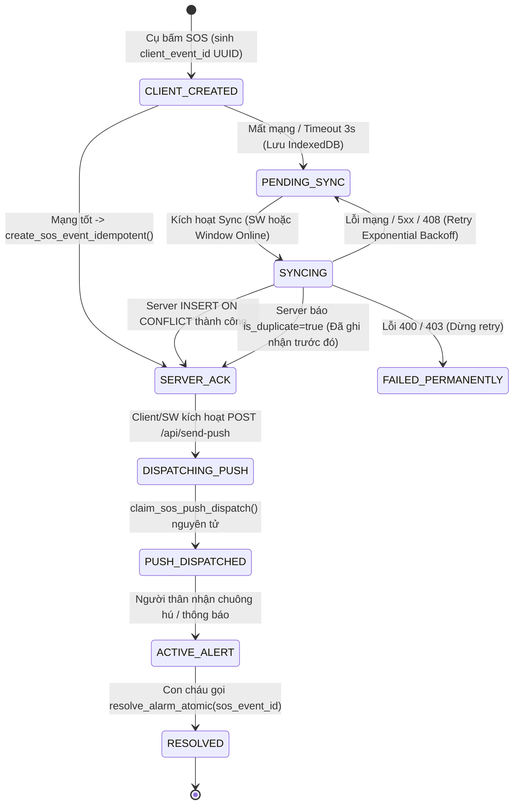

# Product Requirements Document (PRD): Chuyên Sâu Hạ Tầng - Đồng Thời & Khôi Phục Ngoại Tuyến (Concurrency & Offline Resilience System)

> **Mã tài liệu:** `PRD_Deep_v1.md`  
> **Dự án:** SafeCheck - Hệ thống Điểm danh & Cứu hộ Người cao tuổi  
> **Phiên bản:** v3.0 (Production Architecture Signed-off)  
> **Trạng thái:** Đã phê duyệt kiến trúc - Sẵn sàng lập Implementation Plan  
> **Tác giả:** Đội ngũ Kỹ thuật SafeCheck  
> **Hệ quy chiếu chuẩn:** Thực thể lõi gồm `elderly_id` (UUID), `sos_events` (Source of Truth khẩn cấp), `family_links` (`status = 'accepted'`). Tuyệt đối loại bỏ việc lưu trữ `pairing_code` trong nhật ký kiểm toán.  
> **Tham chiếu liên quan:** [`PRD.md`](file:///c:/Users/lhp14/learn_afterUni/SafeCheck/PRD.md), [`PRD_AUTH_FAMILY.md`](file:///c:/Users/lhp14/learn_afterUni/SafeCheck/PRD_AUTH_FAMILY.md), [`PRD_SOS.md`](file:///c:/Users/lhp14/learn_afterUni/SafeCheck/PRD_SOS.md), [`PRD_NotiSOS.md`](file:///c:/Users/lhp14/learn_afterUni/SafeCheck/PRD_NotiSOS.md)

---

## 1. Bối cảnh & Vấn đề Nghiệp vụ (Problem Statement)

SafeCheck là ứng dụng bảo vệ an toàn sinh mạng cho người cao tuổi. Trong môi trường vận hành thực tế, hai vấn đề kỹ thuật nguy cấp sau đây đòi hỏi thiết kế kiến trúc chuẩn mực và an toàn tuyệt đối:

### 1.1. Vấn đề 1: Tranh chấp dữ liệu đồng thời (Concurrency & Race Condition)
- **Kịch bản thực tế 1 (Resolve Alarm):** Cụ bà kích hoạt báo động đỏ (SOS) sinh ra bản ghi `sos_events`. Toàn bộ người thân trong gia đình (Con A, Con B) cùng mở app và **bấm nút "Xác nhận an toàn / Tắt báo động" vào cùng một phần nghìn giây (millisecond)**.
  - *Hậu quả nếu dùng UPDATE thông thường:* Dữ liệu bị ghi đè không kiểm soát (dirty write), cả hai máy đều báo thành công khiến Con B hiểu lầm mình là người xử lý, làm sai lệch nhật ký kiểm toán (Audit Trail) và kích hoạt nhiều sự kiện giải quyết trùng lặp.
  - *Yêu cầu chuẩn hóa:* Con A và Con B phải chỉ định rõ đích danh `sos_event_id` cần giải quyết; không được để hàm RPC đoán mò sự kiện gần nhất (loại bỏ hoàn toàn fallback `p_sos_event_id = NULL` ở production path).
- **Kịch bản thực tế 2 (Concurrent Ping):** Thấy Cụ trễ điểm danh, Con A và Con B cùng bấm nút **"Gửi chuông kiểm tra" (Ping)** đồng thời.
  - *Hậu quả race condition:* Nếu kiểm tra hàng `checkin_logs` khi bản ghi ngày hôm đó chưa từng tồn tại, cả 2 transaction đều đọc 0 hàng, cùng vượt qua kiểm tra Cooldown và cùng ghi nhận thành công, gây spam chuông báo động tới Cụ.
  - *Yêu cầu chuẩn hóa:* Serialize thao tác Ping bằng cách khóa trực tiếp trên hàng Profile của Cụ (`public.profiles WHERE id = p_elderly_id FOR UPDATE`) - thực thể luôn tồn tại 100% trong database.

### 1.2. Vấn đề 2: Điểm mù ngoại tuyến khi Cụ cần cứu hộ (Offline SOS & Data Loss)
- **Kịch bản thực tế:** Người cao tuổi té ngã trong phòng tắm kín hoặc tầng hầm – nơi mất sóng Wi-Fi/4G. Cụ nhấn giữ nút SOS 3 giây.
  - Nếu frontend chỉ sử dụng hàm `fetch()` thông thường gọi lên API, Promise sẽ reject với lỗi `NetworkError`. Nếu không có hàng đợi bền vững cục bộ (Persistent Queue trong IndexedDB), tín hiệu kêu cứu của Cụ biến mất hoàn toàn.
- **Thách thức kỹ thuật:**
  1. **Idempotency nguyên tử khi retry:** Client gửi lại cùng một yêu cầu SOS nhiều lần do mạng chập chờn. Phía server bắt buộc phải dùng cơ chế `INSERT ... ON CONFLICT (client_event_id) DO NOTHING` nguyên tử, triệt tiêu hoàn toàn race condition dạng `SELECT -> NOT FOUND -> INSERT -> UNIQUE VIOLATION`.
  2. **Bảo toàn chuỗi Dispatch Web Push:** Khi client retry nhận được `is_duplicate = true` (Idempotent ACK), hệ thống vẫn phải bảo đảm Web Push được kích hoạt gửi tới người thân thông qua cơ chế `claim_sos_push_dispatch` an toàn.
  3. **Giới hạn thực tế của Web Platform:** Phân biệt rõ ràng giữa W3C Background Sync API (`SyncManager` trên Android/Chromium) và In-App Event Listener (`window.online` trên iOS Safari). Không hứa hẹn capability chạy ngầm khi app đã đóng trên iOS.
  4. **Kênh cứu hộ viễn thông tối thượng (Fail-safe Cellular Voice):** Khi mất mạng Internet kéo dài, giao diện máy Cụ phải chuyển sang kênh thoại viễn thông di động (`tel:115` và `tel:phone_con_chau`) chỉ với 1 chạm.

---

## 2. Mục tiêu & Cam kết Kỹ thuật (Goals & Engineering Guarantees)

| Hạng mục | Cam kết Kỹ thuật (Realistic Guarantees) | Tiêu chí Hoàn thành |
| :--- | :--- | :--- |
| **Bảo mật RPC 2 Lớp (Defense-in-Depth)** | Lớp 1: `REVOKE EXECUTE FROM PUBLIC, anon; GRANT TO authenticated;`. Lớp 2: Kiểm tra `auth.uid() IS NOT NULL`, xác thực `family_links.status = 'accepted'`, và khóa cứng `SET search_path = ''`. | 100% chặn đứng Anonymous và SQL Search Path hijacking. |
| **Source of Truth duy nhất: `sos_events`** | `sos_events` là thực thể duy nhất quyết định trạng thái báo động khẩn cấp. Hàm `resolve_alarm_atomic` **bắt buộc tham số `p_sos_event_id UUID`**. | Triệt tiêu hoàn toàn nhập nhằng ngữ nghĩa giữa nhiều sự kiện SOS đồng thời. |
| **Idempotency Nguyên tử Cấp Cơ sở Dữ liệu** | Dùng `INSERT ... ON CONFLICT (client_event_id) DO NOTHING RETURNING *`. Nếu không có hàng trả về $\rightarrow$ Đọc bản ghi đã tồn tại và trả về `is_duplicate = true`. | Không bao giờ văng ngoại lệ `unique_violation` khi 2 transaction cùng retry một `client_event_id`. |
| **Khóa Serialize Ping Bền Vững** | Khóa `public.profiles WHERE id = p_elderly_id FOR UPDATE`. | Đúng 1 request gửi Ping thành công; request thứ hai nhận mã lỗi `CONFLICT_PING_ALREADY_SENT`. |
| **Bảo mật Dữ liệu Kiểm toán (Data Minimization)** | Bảng `alarm_logs` **tuyệt đối không lưu `pairing_code`**. Chỉ lưu các định danh nghiệp vụ: `elderly_id`, `sos_event_id`, `performed_by`. | Chống rò rỉ mã liên kết nhạy cảm trong lịch sử kiểm toán. |
| **Audit Trail Nguyên tử (All-or-Nothing)** | Cập nhật `sos_events` và `INSERT alarm_logs` nằm trong cùng một transaction. Ghi audit thất bại $\rightarrow$ Toàn bộ transaction rollback. | Không bao giờ có tình trạng dữ liệu state bị thay đổi mà thiếu nhật ký kiểm toán. |
| **Kích hoạt Fallback UI Dựa Trên State** | Thẻ gọi điện viễn thông `CellularFallbackCard` được kích hoạt theo công thức: `isSOSActive && !hasServerAck && (Date.now() - sosCreatedAt >= 10000)`. | Không phụ thuộc mù quáng vào JavaScript timer khi máy bị sleep/background throttling. |

---

## 3. Vòng đời Trạng thái & Cơ chế Bảo toàn Web Push

### 3.1. State Machine & Chu trình Idempotent Dispatch



> **Nguyên tắc bảo toàn Web Push khi Retry:**  
> Kể cả khi lệnh gọi RPC `create_sos_event_idempotent` trả về `is_duplicate = true` (do lần gửi trước database đã ghi nhận nhưng phản hồi mạng bị rớt), Client hoặc Service Worker **vẫn tiếp tục gọi `POST /api/send-push` với `sos_event_id` nhận được**. Hàm `claim_sos_push_dispatch` trên server sẽ kiểm tra nguyên tử: nếu đợt push trước chưa hoàn tất, push sẽ được phát tán ngay lập tức; nếu đã phát tán rồi, server trả về `already_dispatched` một cách an toàn mà không spam.

---

## 4. Thiết kế Cơ sở Dữ liệu & RPC Functions (Database Architecture)

### 4.1. Bổ sung Idempotency Key vào Bảng `sos_events`

```sql
-- 1. Thêm cột client_event_id để bảo đảm tính bất biến (Idempotency) khi offline retry
ALTER TABLE public.sos_events
ADD COLUMN IF NOT EXISTS client_event_id UUID UNIQUE,
ADD COLUMN IF NOT EXISTS resolution_note TEXT;

CREATE INDEX IF NOT EXISTS idx_sos_events_client_id ON public.sos_events(client_event_id);
```

### 4.2. Bảng `alarm_logs` (Nhật ký Kiểm toán Tối Giản Bảo Mật - Data Minimization)

```sql
-- Tuyệt đối KHÔNG lưu pairing_code trong bảng này
CREATE TABLE IF NOT EXISTS public.alarm_logs (
    id UUID PRIMARY KEY DEFAULT gen_random_uuid(),
    elderly_id UUID NOT NULL REFERENCES public.profiles(id) ON DELETE CASCADE,
    sos_event_id UUID REFERENCES public.sos_events(id) ON DELETE SET NULL,
    action VARCHAR(30) NOT NULL CHECK (action IN ('SOS_TRIGGERED', 'RESOLVE', 'PING', 'CHECKIN_SAFE')),
    performed_by UUID NOT NULL REFERENCES public.profiles(id),
    performer_name VARCHAR(100) NOT NULL,
    performer_role VARCHAR(20) NOT NULL,
    note TEXT,
    previous_state VARCHAR(30),
    new_state VARCHAR(30),
    metadata JSONB DEFAULT '{}'::jsonb,
    created_at TIMESTAMPTZ NOT NULL DEFAULT timezone('utc'::text, now())
);

CREATE INDEX IF NOT EXISTS idx_alarm_logs_elderly ON public.alarm_logs(elderly_id, created_at DESC);
CREATE INDEX IF NOT EXISTS idx_alarm_logs_sos_event ON public.alarm_logs(sos_event_id);

-- RLS cho alarm_logs
ALTER TABLE public.alarm_logs ENABLE ROW LEVEL SECURITY;
DROP POLICY IF EXISTS "Users can view relevant alarm logs" ON public.alarm_logs;
CREATE POLICY "Users can view relevant alarm logs"
ON public.alarm_logs FOR SELECT
USING (
  auth.uid() = elderly_id OR
  EXISTS (
    SELECT 1 FROM public.family_links fl
    WHERE fl.elderly_id = alarm_logs.elderly_id
      AND fl.caregiver_id = auth.uid()
      AND fl.status = 'accepted'
  )
);
```

### 4.3. Hàm RPC Khởi tạo SOS Nguyên Tử `create_sos_event_idempotent`

```sql
CREATE OR REPLACE FUNCTION public.create_sos_event_idempotent(
  p_elderly_id UUID,
  p_client_event_id UUID,
  p_trigger_source TEXT DEFAULT 'button'
) RETURNS JSONB
LANGUAGE plpgsql
SECURITY DEFINER
SET search_path = ''
AS $$
DECLARE
  v_caller_id UUID := auth.uid();
  v_existing_event RECORD;
  v_new_event RECORD;
  v_pairing_code VARCHAR;
  v_caller_name VARCHAR;
  v_caller_role VARCHAR;
BEGIN
  -- 1. Bảo mật: Chặn Anonymous Caller
  IF v_caller_id IS NULL THEN
    RAISE EXCEPTION 'Unauthorized: Yêu cầu đăng nhập để thực hiện tác vụ này' USING ERRCODE = '42501';
  END IF;

  -- 2. Xác thực quyền: Người gọi phải là Cụ, hoặc con cháu đã liên kết accepted
  IF v_caller_id <> p_elderly_id AND NOT EXISTS (
    SELECT 1 FROM public.family_links
    WHERE elderly_id = p_elderly_id 
      AND caregiver_id = v_caller_id 
      AND status = 'accepted'
  ) THEN
    RAISE EXCEPTION 'Forbidden: Bạn không có quyền kích hoạt báo động cho người dùng này' USING ERRCODE = '42501';
  END IF;

  -- 3. INSERT NGUYÊN TỬ VỚI ON CONFLICT (Triệt tiêu hoàn toàn race condition)
  INSERT INTO public.sos_events (
    elderly_id, client_event_id, status, trigger_source
  ) VALUES (
    p_elderly_id, p_client_event_id, 'active', COALESCE(p_trigger_source, 'button')
  )
  ON CONFLICT (client_event_id) DO NOTHING
  RETURNING * INTO v_new_event;

  -- Nếu không có dòng nào được insert -> Request này là Duplicate/Retry do xung đột đồng thời
  IF v_new_event.id IS NULL THEN
    SELECT id, status, created_at INTO v_existing_event
    FROM public.sos_events
    WHERE client_event_id = p_client_event_id;

    RETURN jsonb_build_object(
      'success', true,
      'sos_event_id', v_existing_event.id,
      'status', v_existing_event.status,
      'is_duplicate', true,
      'message', 'Sự kiện đã được ghi nhận trước đó (Idempotent ACK)'
    );
  END IF;

  -- 4. Đọc pairing_code và profile để phản chiếu trạng thái
  SELECT pairing_code INTO v_pairing_code FROM public.profiles WHERE id = p_elderly_id;
  SELECT full_name, role INTO v_caller_name, v_caller_role FROM public.profiles WHERE id = v_caller_id;

  -- Phản chiếu trạng thái sang checkin_logs hôm nay
  IF v_pairing_code IS NOT NULL THEN
    INSERT INTO public.checkin_logs (family_code, log_date, status, source)
    VALUES (v_pairing_code, CURRENT_DATE, 'Emergency', 'SOS')
    ON CONFLICT (family_code, log_date)
    DO UPDATE SET status = 'Emergency', source = 'SOS';
  END IF;

  -- 5. Ghi Audit Log trong cùng transaction (Tuyệt đối không lưu pairing_code)
  INSERT INTO public.alarm_logs (
    elderly_id, sos_event_id, action,
    performed_by, performer_name, performer_role, new_state
  ) VALUES (
    p_elderly_id, v_new_event.id, 'SOS_TRIGGERED',
    v_caller_id, COALESCE(v_caller_name, 'Người dùng'), COALESCE(v_caller_role, 'elderly'), 'Emergency'
  );

  RETURN jsonb_build_object(
    'success', true,
    'sos_event_id', v_new_event.id,
    'status', 'active',
    'is_duplicate', false,
    'message', 'Đã kích hoạt sự kiện cứu hộ thành công'
  );
END;
$$;
```

### 4.4. Hàm RPC Nguyên tử `resolve_alarm_atomic` (Bắt buộc `p_sos_event_id`)

```sql
CREATE OR REPLACE FUNCTION public.resolve_alarm_atomic(
  p_elderly_id UUID,
  p_sos_event_id UUID,
  p_note TEXT DEFAULT 'Xác nhận an toàn từ ứng dụng'
) RETURNS JSONB
LANGUAGE plpgsql
SECURITY DEFINER
SET search_path = ''
AS $$
DECLARE
  v_caller_id UUID := auth.uid();
  v_caller_name VARCHAR(100);
  v_caller_role VARCHAR(20);
  v_pairing_code VARCHAR;
  v_target_sos RECORD;
  v_last_resolver_name VARCHAR;
  v_last_resolved_at TIMESTAMPTZ;
BEGIN
  -- 1. Bảo mật: Chặn đứng Anonymous Caller
  IF v_caller_id IS NULL THEN
    RAISE EXCEPTION 'Unauthorized: Yêu cầu đăng nhập để thực hiện tác vụ này' USING ERRCODE = '42501';
  END IF;

  -- 2. Kiểm tra tham số bắt buộc (Production path: bắt buộc có sos_event_id)
  IF p_sos_event_id IS NULL THEN
    RAISE EXCEPTION 'Bad Request: Yêu cầu cung cấp p_sos_event_id cần giải quyết' USING ERRCODE = '22023';
  END IF;

  -- 3. Xác thực quan hệ gia đình (Caregiver phải có link accepted hoặc chính Cụ)
  IF v_caller_id <> p_elderly_id AND NOT EXISTS (
    SELECT 1 FROM public.family_links
    WHERE elderly_id = p_elderly_id 
      AND caregiver_id = v_caller_id 
      AND status = 'accepted'
  ) THEN
    RAISE EXCEPTION 'Forbidden: Bạn không có quyền giải quyết báo động của người dùng này' USING ERRCODE = '42501';
  END IF;

  -- 4. Lấy thông tin người thực hiện & pairing_code của Cụ
  SELECT full_name, role INTO v_caller_name, v_caller_role FROM public.profiles WHERE id = v_caller_id;
  SELECT pairing_code INTO v_pairing_code FROM public.profiles WHERE id = p_elderly_id;

  -- 5. KHÓA ĐÍCH DANH HÀNG SOS_EVENTS ĐƯỢC CHỈ ĐỊNH (Source of Truth)
  SELECT * INTO v_target_sos
  FROM public.sos_events
  WHERE id = p_sos_event_id AND elderly_id = p_elderly_id
  FOR UPDATE;

  -- 6. Xử lý trường hợp xung đột: Sự kiện không tồn tại hoặc đã được resolve trước đó
  IF v_target_sos.id IS NULL OR v_target_sos.status <> 'active' THEN
    -- Truy vấn nhanh ai là người vừa resolve sự kiện này trong alarm_logs
    SELECT performer_name, created_at 
    INTO v_last_resolver_name, v_last_resolved_at
    FROM public.alarm_logs
    WHERE sos_event_id = p_sos_event_id AND action = 'RESOLVE'
    ORDER BY created_at DESC LIMIT 1;

    RETURN jsonb_build_object(
      'success', false,
      'error', 'CONFLICT_ALREADY_RESOLVED',
      'message', 'Báo động này đã được xử lý bởi ' || COALESCE(v_last_resolver_name, 'thành viên khác trong gia đình') || '.',
      'resolved_by_name', COALESCE(v_last_resolver_name, 'Người thân'),
      'resolved_at', v_last_resolved_at
    );
  END IF;

  -- 7. CẬP NHẬT NGUYÊN TỬ: Chuyển status sos_events sang 'resolved'
  UPDATE public.sos_events
  SET status = 'resolved',
      resolved_at = NOW(),
      resolved_by = v_caller_id,
      resolution_note = p_note
  WHERE id = v_target_sos.id;

  -- 8. Phản chiếu trạng thái checkin_logs hôm nay về 'Safe'
  IF v_pairing_code IS NOT NULL THEN
    UPDATE public.checkin_logs
    SET status = 'Safe'
    WHERE family_code = v_pairing_code AND log_date = CURRENT_DATE;
  END IF;

  -- 9. GHI AUDIT TRAIL TRONG CÙNG TRANSACTION (Tuyệt đối không lưu pairing_code)
  INSERT INTO public.alarm_logs (
    elderly_id, sos_event_id, action,
    performed_by, performer_name, performer_role,
    previous_state, new_state, note
  ) VALUES (
    p_elderly_id, v_target_sos.id, 'RESOLVE',
    v_caller_id, COALESCE(v_caller_name, 'Người thân'), COALESCE(v_caller_role, 'caregiver'),
    'active', 'resolved', p_note
  );

  RETURN jsonb_build_object(
    'success', true,
    'message', 'Đã tắt báo động, xác nhận an toàn thành công',
    'sos_event_id', v_target_sos.id,
    'resolved_by', v_caller_name,
    'resolved_at', NOW()
  );
END;
$$;
```

### 4.5. Hàm RPC Nguyên tử `request_ping_atomic` (Khóa Row Trên Bảng `profiles`)

```sql
CREATE OR REPLACE FUNCTION public.request_ping_atomic(
  p_elderly_id UUID
) RETURNS JSONB
LANGUAGE plpgsql
SECURITY DEFINER
SET search_path = ''
AS $$
DECLARE
  v_caller_id UUID := auth.uid();
  v_caller_name VARCHAR(100);
  v_caller_email VARCHAR;
  v_pairing_code VARCHAR;
  v_last_ping TIMESTAMPTZ;
  v_cooldown_interval INTERVAL := INTERVAL '15 minutes';
  v_last_pinger_name VARCHAR;
  v_diff_seconds INT;
  v_locked_elderly_id UUID;
BEGIN
  -- 1. Bảo mật: Chặn Anonymous
  IF v_caller_id IS NULL THEN
    RAISE EXCEPTION 'Unauthorized: Yêu cầu đăng nhập để gửi chuông kiểm tra' USING ERRCODE = '42501';
  END IF;

  -- 2. Kiểm tra quan hệ gia đình (chỉ Caregiver có liên kết accepted)
  IF NOT EXISTS (
    SELECT 1 FROM public.family_links
    WHERE elderly_id = p_elderly_id 
      AND caregiver_id = v_caller_id 
      AND status = 'accepted'
  ) THEN
    RAISE EXCEPTION 'Forbidden: Bạn không có quyền gửi chuông cho Cụ này' USING ERRCODE = '42501';
  END IF;

  -- 3. KHÓA ROW PROFILES CỦA CỤ (Đối tượng đảm bảo luôn tồn tại 100% trong DB)
  SELECT id, pairing_code INTO v_locked_elderly_id, v_pairing_code
  FROM public.profiles
  WHERE id = p_elderly_id
  FOR UPDATE;

  IF NOT FOUND THEN
    RETURN jsonb_build_object('success', false, 'error', 'NOT_FOUND', 'message', 'Không tìm thấy hồ sơ của Cụ');
  END IF;

  -- Lấy thông tin người gọi
  SELECT full_name, email INTO v_caller_name, v_caller_email FROM public.profiles WHERE id = v_caller_id;

  -- Hỗ trợ tài khoản tester: Cooldown rút ngắn còn 10 giây
  IF LOWER(COALESCE(v_caller_email, '')) = 'test01@gmail.com' THEN
    v_cooldown_interval := INTERVAL '10 seconds';
  END IF;

  -- 4. Kiểm tra thời điểm Ping gần nhất từ checkin_logs
  SELECT ping_requested_at INTO v_last_ping
  FROM public.checkin_logs
  WHERE family_code = v_pairing_code AND log_date = CURRENT_DATE;

  -- 5. Nếu đang trong Cooldown -> Báo lỗi xung đột ngay lập tức
  IF v_last_ping IS NOT NULL AND (NOW() - v_last_ping) < v_cooldown_interval THEN
    v_diff_seconds := EXTRACT(EPOCH FROM (NOW() - v_last_ping))::INT;
    
    SELECT performer_name INTO v_last_pinger_name
    FROM public.alarm_logs
    WHERE elderly_id = p_elderly_id AND action = 'PING'
    ORDER BY created_at DESC LIMIT 1;

    RETURN jsonb_build_object(
      'success', false,
      'error', 'CONFLICT_PING_ALREADY_SENT',
      'message', 'Chuông kiểm tra vừa được gửi bởi ' || COALESCE(v_last_pinger_name, 'thành viên khác') || ' cách đây ' || v_diff_seconds || ' giây.',
      'last_pinger_name', COALESCE(v_last_pinger_name, 'Người thân'),
      'remaining_seconds', EXTRACT(EPOCH FROM (v_cooldown_interval - (NOW() - v_last_ping)))::INT
    );
  END IF;

  -- 6. Cập nhật hoặc tạo mới bản ghi checkin_logs ngày hôm nay
  INSERT INTO public.checkin_logs (family_code, log_date, status, ping_requested_at, elderly_id)
  VALUES (v_pairing_code, CURRENT_DATE, 'Ping_Requested', NOW(), p_elderly_id)
  ON CONFLICT (family_code, log_date)
  DO UPDATE SET status = 'Ping_Requested', ping_requested_at = NOW();

  -- 7. Ghi Audit Log vào alarm_logs (Không lưu pairing_code)
  INSERT INTO public.alarm_logs (
    elderly_id, action, performed_by, performer_name, performer_role, new_state
  ) VALUES (
    p_elderly_id, 'PING', v_caller_id, COALESCE(v_caller_name, 'Người thân'), 'caregiver', 'Ping_Requested'
  );

  RETURN jsonb_build_object(
    'success', true,
    'message', 'Đã phát chuông kiểm tra tới máy Cụ'
  );
END;
$$;
```

### 4.6. Siết chặt Phân Quyền Thực Thi (Function Execution Privileges)

```sql
-- Thu hồi quyền thực thi mặc định của PUBLIC và anon
REVOKE EXECUTE ON FUNCTION public.create_sos_event_idempotent(UUID, UUID, TEXT) FROM PUBLIC, anon;
REVOKE EXECUTE ON FUNCTION public.resolve_alarm_atomic(UUID, UUID, TEXT) FROM PUBLIC, anon;
REVOKE EXECUTE ON FUNCTION public.request_ping_atomic(UUID) FROM PUBLIC, anon;

-- Chỉ cấp quyền cho role authenticated
GRANT EXECUTE ON FUNCTION public.create_sos_event_idempotent(UUID, UUID, TEXT) TO authenticated;
GRANT EXECUTE ON FUNCTION public.resolve_alarm_atomic(UUID, UUID, TEXT) TO authenticated;
GRANT EXECUTE ON FUNCTION public.request_ping_atomic(UUID) TO authenticated;
```

---

## 5. Tầng Ứng dụng & PWA (Frontend & Service Worker)

### 5.1. Cấu trúc Hàng đợi trong IndexedDB (`offlineQueueService.ts`)

```typescript
export interface OfflineSOSEvent {
  client_event_id: string;   // UUID v4 sinh tại client: crypto.randomUUID()
  elderly_id: string;        // UUID của Cụ
  trigger_source: 'button' | 'timeout';
  created_at: number;        // Epoch timestamp (ms)
  status: 'PENDING_SYNC' | 'SYNCING' | 'SYNCED' | 'FAILED_PERMANENTLY';
  retry_count: number;
  last_attempt_at?: number;
  last_http_status?: number;
  error_message?: string;
}
```

### 5.2. Chính sách Phân Loại Lỗi & Quản lý Thử Lại

```typescript
// Xử lý phản hồi từ RPC create_sos_event_idempotent
if (response.error) {
  const status = response.error.status || 500;
  if (status === 400 || status === 403) {
    // Lỗi nghiệp vụ hoặc phân quyền vĩnh viễn -> Dừng retry
    await markSOSPermanentFailure(event.client_event_id, response.error.message);
  } else {
    // Lỗi mạng hoặc 5xx/408 -> Xếp lịch Exponential Backoff
    await scheduleRetry(event.client_event_id);
  }
} else {
  // Thành công (Kể cả is_duplicate = true) -> Đánh dấu SYNCED và trigger dispatch push
  await markSOSSynced(event.client_event_id);
  await triggerSendPush(response.data.sos_event_id);
}
```

### 5.3. Kích Hoạt Thẻ Khẩn Cấp Viễn Thông Dựa Trên State (`CellularFallbackCard.tsx`)

Tránh phụ thuộc mù quáng vào `setTimeout`:
```typescript
// Được tính toán mỗi chu kỳ render, khi resume app hoặc page visibility change:
const elapsedMs = sosStartTime ? (Date.now() - sosStartTime) : 0;
const shouldShowCellularFallback = 
  isSOSActive === true &&
  hasServerAck === false &&
  elapsedMs >= 10000;
```

---

## 6. Ma trận Kịch bản Kiểm thử Tự động (Playwright Test Plan)

Bộ test được tổ chức chặt chẽ bao quát toàn bộ các góc cạnh bảo mật và tranh chấp đồng thời:

### Kịch bản 1: `07_concurrency_race_condition.spec.ts`
- **Sub-test 07A (Concurrent Resolve $\times$ 2):** 2 Browser Contexts cùng gọi `resolve_alarm_atomic(elderly_id, sos_event_id)` qua `Promise.all` $\rightarrow$ Đúng 1 bên HTTP 200 / Success, 1 bên nhận `CONFLICT_ALREADY_RESOLVED` và UI hiển thị đúng tên người xử lý; `alarm_logs` chỉ có đúng 1 bản ghi `RESOLVE`.
- **Sub-test 07B (Concurrent Ping $\times$ 2):** 2 Browser Contexts cùng bấm "Gửi chuông kiểm tra" đồng thời $\rightarrow$ Đúng 1 bên thành công, bên còn lại nhận `CONFLICT_PING_ALREADY_SENT` với thời gian cooldown còn lại.
- **Sub-test 07C (Unauthorized Resolve):** Caregiver chưa được liên kết hoặc bị revoked gọi resolve $\rightarrow$ Nhận lỗi `403 / Forbidden`.
- **Sub-test 07D (Anonymous RPC Execution):** Gọi RPC khi chưa đăng nhập (`auth.uid() = null`) $\rightarrow$ Bị chặn ngay từ tầng function privilege / ném `401 / Unauthorized`.

### Kịch bản 2: `08_offline_resilience_sync.spec.ts`
- **Deterministic Application Test:**
  1. Đăng nhập Cụ bà $\rightarrow$ `await context.setOffline(true)`.
  2. Bấm SOS $\rightarrow$ Assert IndexedDB có bản ghi `PENDING_SYNC` với `client_event_id`.
  3. Duy trì offline > 10s $\rightarrow$ Assert `CellularFallbackCard` xuất hiện với các nút gọi `tel:115` và `tel:phone`.
  4. Bật mạng lại: `await context.setOffline(false)` $\rightarrow$ Kích hoạt `window.dispatchEvent(new Event('online'))`.
  5. Assert bản ghi IndexedDB đổi sang `SYNCED`.
  6. Assert database chỉ có **chính xác 1 bản ghi `sos_events`** với `client_event_id` đó.
  7. Giả lập retry gửi lại đúng `client_event_id` đó $\rightarrow$ Assert server trả `is_duplicate = true` mà không tạo duplicate row hay lỗi `unique_violation`.

---

## 7. Lộ trình Triển khai Kỹ thuật (Implementation Roadmap)

Sau khi tài liệu PRD phiên bản v3.0 này được ký duyệt:
1. **Bước 1: Lập Implementation Plan chi tiết (`implementation_plan.md`)**:
   - Phân tách theo đúng thứ tự: Contract DB $\rightarrow$ RPC Functions $\rightarrow$ Execution Privileges $\rightarrow$ Frontend Services & IndexedDB $\rightarrow$ Fallback UI Component $\rightarrow$ Playwright Test Suites.
2. **Bước 2: SQL Migration**:
   - Viết và chạy file migration: `supabase/migrations/20260911000000_concurrency_offline_schema.sql`.
3. **Bước 3: Tầng Frontend & Services**:
   - Xây dựng `src/services/offlineQueueService.ts`.
   - Cập nhật `public/sw.js`.
   - Xây dựng `src/components/CellularFallbackCard.tsx`.
   - Cập nhật `src/App.tsx` và `src/components/CaregiverScreen.tsx`.
4. **Bước 4: Kiểm thử Tự động Playwright**:
   - Triển khai `tests/07_concurrency_race_condition.spec.ts` (07A, 07B, 07C, 07D).
   - Triển khai `tests/08_offline_resilience_sync.spec.ts`.
   - Chạy kiểm thử toàn diện bảo đảm 100% test pass.
5. **Bước 5: Tổng kết Walkthrough (`walkthrough.md`)**.
