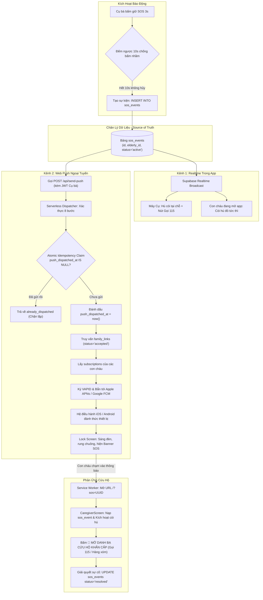

# Product Requirements Document (PRD): Hệ thống Thông báo Đẩy Khẩn cấp Ngoại tuyến (Offline Push Notifications & Background Alerts)

> **Tài liệu đặc tả nghiệp vụ mở rộng cho hệ thống SafeCheck**, tập trung vào phân tích quy trình đánh thức thiết bị, phát tán thông báo đẩy khẩn cấp (Web Push Notifications) cho con cháu khi điện thoại tắt màn hình/khoá máy, và thiết lập thực thể sự kiện khẩn cấp (`sos_events`) làm chân lý duy nhất (Source of Truth) cho toàn bộ hệ thống.

---

## 1. Tổng quan & Vấn đề Nghiệp vụ (Problem Statement)

### 1.1. Điểm mù sinh tử của Web Realtime
- **Thực tế kỹ thuật:** SafeCheck sử dụng Supabase Realtime (WebSocket) để đồng bộ trạng thái điểm danh và báo động đỏ giữa Cụ bà và Con cháu. Cơ chế này hoạt động hoàn hảo khi ứng dụng đang mở trên màn hình (Foreground Active).
- **Điểm mù nguy kịch:** Khi con cháu **khóa màn hình điện thoại, vuốt chuyển sang ứng dụng khác (Genshin Impact, TikTok, Messenger) hoặc tắt màn hình đi ngủ**, các hệ điều hành di động (đặc biệt là iOS Safari WebKit trên iPhone) sẽ **đóng băng luồng JavaScript (freeze)** trong vòng 5 - 10 giây để bảo toàn pin.
- **Hậu quả:** WebSocket bị ngắt hoặc tạm dừng. Khi Cụ bà ở nhà bị té ngã hoặc đột quỵ và nhấn nút **SOS**, điện thoại của con cháu **hoàn toàn im lặng**, tín hiệu cầu cứu bị bỏ lỡ trong khoảng thời gian vàng cấp cứu.

### 1.2. Mục tiêu Nghiệp vụ Cốt lõi
Xây dựng kênh truyền dẫn khẩn cấp thứ hai: **Web Push Notifications chuẩn W3C**:
1. **Đánh thức thiết bị từ xa:** Cho phép hệ thống phát tín hiệu qua máy chủ đẩy (Apple Push Notification service - APNs hoặc Google FCM) để bật sáng màn hình, rung chuông và thả biểu ngữ đỏ khẩn cấp lên màn hình khóa (Lock Screen).
2. **1 chạm tiếp cận hiện trường (Deep-link 1 Tap):** Con cháu chạm vào biểu ngữ trên màn hình khóa $\rightarrow$ Ứng dụng SafeCheck mở ra ngay lập tức, điều hướng thẳng tới sự kiện khẩn cấp và kích hoạt còi hú dồn dập.
3. **Bảo mật và Toàn vẹn dữ liệu cấp Y tế/Cứu hộ:** Tuyệt đối chống gửi trùng (Spam duplicate alerts), chống giả mạo quyền gửi và cô lập dữ liệu định danh thiết bị (`push_subscriptions`).

---

## 2. Nền tảng Công nghệ & Cơ chế Web Push

### 2.1. So sánh Cơ chế Truyền dẫn: Realtime vs Web Push
| Tiêu chí | Supabase Realtime (WebSocket) | Web Push Notification (W3C Push API) |
| :--- | :--- | :--- |
| **Mục đích** | Đồng bộ dữ liệu độ trễ thấp (sub-second) khi đang xem app. | Đánh thức thiết bị và báo động khi app đang đóng/tắt màn hình. |
| **Môi trường hoạt động** | Chỉ hoạt động khi tab/app đang mở ở Foreground. | Hoạt động ngầm ở tầng OS thông qua Service Worker (`sw.js`). |
| **Kênh vận chuyển** | Trực tiếp Client $\leftrightarrow$ Supabase Server. | SafeCheck Server $\rightarrow$ APNs (Apple) / FCM (Google) $\rightarrow$ Thiết bị. |
| **Trải nghiệm người dùng** | Giao diện đổi màu đỏ, loa web hú còi trực tiếp. | Màn hình khóa sáng lên, chuông ting ting, banner cảnh báo đỏ. |
| **Vai trò trong SafeCheck** | Kênh trải nghiệm trực quan tại chỗ (In-app). | Kênh cảnh báo triệu tập khẩn cấp (Out-of-app / Offline). |

### 2.2. Cơ chế Xác thực VAPID (Voluntary Application Server Identification)
Web Push không đòi hỏi tài khoản Apple Developer trả phí mà sử dụng chuẩn mã hóa công khai **RFC 8292 (VAPID)**:
- **`VAPID_PUBLIC_KEY` (Khóa công khai):** Được cung cấp cho trình duyệt client để đăng ký nhận diện ứng dụng với `PushManager.subscribe()`. An toàn khi công khai ở frontend.
- **`VAPID_PRIVATE_KEY` (Khóa bí mật):** Chỉ được lưu trữ bí mật tại Serverless Function (Vercel Backend). Dùng để ký số (sign) vào payload trước khi đẩy sang máy chủ Apple/Google.

### 2.3. Đặc thù trên iOS Safari (iPhone 13 Pro Max & iOS 16.4+)
- **Yêu cầu Standalone PWA:** Apple chỉ kích hoạt Web Push API khi người dùng đã thêm ứng dụng vào Màn hình chính (**Add to Home Screen**). Nếu mở trong tab Safari thông thường, PushManager sẽ không khả dụng.
- **Yêu cầu Tương tác Rõ ràng (Explicit User Gesture):** Lệnh xin quyền `Notification.requestPermission()` bắt buộc phải kích hoạt từ một hành động bấm nút có ý thức của người dùng. Không được tự động gọi khi vừa tải trang.

---

## 3. Mô hình Kiến trúc Nghiệp vụ Toàn diện (Source of Truth Architecture)



---

## 4. Chi tiết Quy trình Nghiệp vụ & User Flows

### 4.1. Flow Đăng ký Nhận Cảnh báo Nền (Caregiver Subscription Flow)
1. **Kiểm tra môi trường thiết bị:**
   - Nếu phát hiện đang chạy trên Safari thông thường (chưa Add to Home Screen) trên iPhone: Hiển thị thanh thông báo nhẹ: *"💡 Để nhận chuông báo khi tắt màn hình, hãy bấm nút Chia sẻ $\rightarrow$ Thêm vào Màn hình chính"*.
2. **Quản lý 3 trạng thái phân quyền (Permission States):**
   - **Trạng thái `'default'` (Chưa hỏi):** Hiển thị thẻ Card nổi bật:
     > 🔔 **Bật cảnh báo nền khi tắt app**  
     > *Nhận thông báo đẩy khẩn cấp ngay trên màn hình khóa khi người thân cần cứu hộ.*  
     > `[ BẬT CẢNH BÁO NGAY ]`
   - **Trạng thái `'granted'` (Đã cấp quyền & Lưu DB):** Hiển thị Badge an tâm màu ngọc bích:
     > 🛡️ **Thiết bị này đã bật cảnh báo nền**  
     > *(Sẵn sàng nhận tín hiệu SOS khẩn cấp)*
   - **Trạng thái `'denied'` (Bị chặn do trước đó bấm Từ chối):** Hiển thị hướng dẫn:
     > ⚠️ **Thông báo đang bị chặn trên thiết bị này**  
     > *Vui lòng vào Cài đặt iPhone $\rightarrow$ Safari $\rightarrow$ Nâng cao $\rightarrow$ Bật lại thông báo cho SafeCheck.*
3. **Thao tác đăng ký an toàn:**
   - Khi bấm nút `[ BẬT CẢNH BÁO NGAY ]`: Gọi `Notification.requestPermission()`.
   - Nếu người dùng chọn **"Cho phép" (Allow)**:
     - Lấy `registration.pushManager.subscribe()`.
     - Trích xuất `{ endpoint, keys: { p256dh, auth } }`.
     - Lấy `user.id` từ phiên đăng nhập hiện tại (`supabase.auth.getUser()`).
     - Lưu vào cơ sở dữ liệu `push_subscriptions`. Không truyền `user_id` hay `family_id` từ UI tham số.

---

### 4.2. Flow Kích hoạt Báo động & Phát tán Thông báo (SOS Push Dispatch Flow)
1. **Kích hoạt từ Cụ bà:** Cụ bà nhấn giữ 3 giây $\rightarrow$ 10 giây đếm ngược an toàn trôi qua mà không bị hủy.
2. **Khởi tạo Chân lý Dữ liệu:**
   - Tạo bản ghi mới vào bảng `sos_events` với `status = 'active'`, `trigger_source = 'button'`.
   - Lấy mã định danh `sos_event_id` vừa sinh.
3. **Gọi Dispatcher:** Client gửi request tới endpoint `/api/send-push` với payload duy nhất:
   ```json
   {
     "sos_event_id": "8f3b1b9e-3d12-4f8a-a43b-7a5b3f112e45"
   }
   ```
4. **Pipeline Xử lý 8 Bước Bảo mật tại Serverless Dispatcher:**
   - **Bước 1 (Authenticate):** Kiểm tra JWT Header `Authorization: Bearer <token>`.
   - **Bước 2 (Authorize):** Kiểm tra Caller có phải là chủ sở hữu sự kiện (`auth.uid() = sos_events.elderly_id`).
   - **Bước 3 (Atomic Idempotency Claim):** Thực thi lệnh SQL nguyên tử:
     ```sql
     UPDATE sos_events 
     SET push_dispatched_at = now(), push_dispatched_count = push_dispatched_count + 1 
     WHERE id = $1 AND push_dispatched_at IS NULL 
     RETURNING *;
     ```
     Nếu không trả về dòng nào $\rightarrow$ Trả về `200 OK` `{ status: 'already_dispatched' }`, kết thúc ngay.
   - **Bước 4 (Resolve Caregivers):** Truy vấn `family_links` tìm toàn bộ `caregiver_id` có `elderly_id = sos_event.elderly_id` và `status = 'accepted'`.
   - **Bước 5 (Resolve Subscriptions):** Dùng `SUPABASE_SERVICE_ROLE_KEY` đọc toàn bộ subscriptions của các caregiver tìm được.
   - **Bước 6 (VAPID Dispatch):** Định dạng nội dung thông báo:
     - Tiêu đề: `🚨 SafeCheck - BÁO ĐỘNG SOS KHẨN CẤP!`
     - Nội dung: `Bà Ngoại vừa kích hoạt báo động cứu hộ! Nhấn để kiểm tra ngay.`
     - Dynamic Tag: `safecheck-sos-${sos_event_id}`
     - URL Deep-link: `/?sos=${sos_event_id}`
     - Gửi song song bằng `Promise.allSettled()`.
   - **Bước 7 (Housekeeping dọn dẹp):** Nếu Apple APNs / Google FCM trả về HTTP `410 Gone` hoặc `404 Not Found` (người dùng đã xóa icon PWA khỏi màn hình chính) $\rightarrow$ Tự động xóa subscription rác khỏi database.
   - **Bước 8 (Phản hồi):** Trả về `{ success: true, dispatched_count: N }`.

---

### 4.3. Flow Tiếp nhận Thông báo & Phản ứng Khẩn cấp (Caregiver Ingestion & Alarm Flow)
1. **Hiển thị trên Màn hình khóa:**
   - Hệ điều hành bật sáng màn hình.
   - Biểu ngữ thông báo màu đỏ hiển thị kèm biểu tượng tấm khiên Retina (`/apple-touch-icon.png`).
2. **Xử lý Chạm thông báo (Notification Click):**
   - Service Worker (`sw.js`) bắt sự kiện `notificationclick`.
   - Tự động đóng notification.
   - Tìm cửa sổ SafeCheck đang chạy ngầm hoặc mở tab mới trỏ thẳng vào: `/?sos=<sos_event_id>`.
3. **Kích hoạt Báo động phía Giao diện Caregiver:**
   - `App.tsx` / `CaregiverScreen.tsx` phát hiện query param `?sos=<id>`.
   - Tải chi tiết sự kiện từ `sos_events`.
   - Kích hoạt trình phát còi hú `SirenPlayer`.
   - **Xử lý chặn âm thanh tự động (Autoplay Fallback):** Trình duyệt iOS Safari có thể hạn chế phát âm thanh nếu không có thao tác bấm trực tiếp trên trang. Hệ thống hiển thị ngay một nút khẩn cấp nhấp nháy đỏ to bản:
     > 🚨 **CHẠM VÀO ĐÂY ĐỂ BẬT CÒI BÁO ĐỘNG NGAY!**

---

### 4.4. Flow Xử lý Hoàn tất Báo động (Resolution Flow)
1. Con cháu mở **Danh bạ Cứu hộ Khẩn cấp**, liên hệ với Cụ hoặc người ứng cứu tại chỗ.
2. Sau khi xác nhận an toàn, con cháu bấm nút: `🟢 XÁC NHẬN AN TOÀN / TẮT BÁO ĐỘNG`.
3. Hệ thống cập nhật:
   ```sql
   UPDATE sos_events
   SET status = 'resolved',
       resolved_at = now(),
       resolved_by = auth.uid()
   WHERE id = $sos_event_id;
   ```
4. Còi hú tắt trên toàn bộ các thiết bị con cháu và Cụ bà.

---

## 5. Thiết kế Cơ sở Dữ liệu & Bảo mật Dữ liệu (Data & Security Schema)

### 5.1. Bảng `sos_events` (Thực thể Sự kiện Khẩn cấp)
```sql
CREATE TABLE public.sos_events (
    id UUID PRIMARY KEY DEFAULT gen_random_uuid(),
    elderly_id UUID NOT NULL REFERENCES public.profiles(id) ON DELETE CASCADE,
    status TEXT NOT NULL DEFAULT 'active' CHECK (status IN ('active', 'resolved', 'cancelled')),
    trigger_source TEXT NOT NULL DEFAULT 'button' CHECK (trigger_source IN ('button', 'timeout', 'fall_detection')),
    latitude DOUBLE PRECISION,
    longitude DOUBLE PRECISION,
    address TEXT,
    push_dispatched_at TIMESTAMPTZ,
    push_dispatched_count INT NOT NULL DEFAULT 0,
    created_at TIMESTAMPTZ NOT NULL DEFAULT timezone('utc'::text, now()),
    resolved_at TIMESTAMPTZ,
    resolved_by UUID REFERENCES public.profiles(id)
);

CREATE INDEX idx_sos_events_elderly ON public.sos_events(elderly_id);
CREATE INDEX idx_sos_events_status ON public.sos_events(status);
```

### 5.2. Bảng `push_subscriptions` (Định danh Thiết bị Ngoại tuyến)
```sql
CREATE TABLE public.push_subscriptions (
    id UUID PRIMARY KEY DEFAULT gen_random_uuid(),
    user_id UUID NOT NULL REFERENCES public.profiles(id) ON DELETE CASCADE,
    endpoint TEXT NOT NULL UNIQUE,
    p256dh TEXT NOT NULL,
    auth TEXT NOT NULL,
    platform TEXT NOT NULL DEFAULT 'unknown' CHECK (platform IN ('ios', 'android', 'desktop', 'unknown')),
    user_agent TEXT,
    created_at TIMESTAMPTZ NOT NULL DEFAULT timezone('utc'::text, now()),
    updated_at TIMESTAMPTZ NOT NULL DEFAULT timezone('utc'::text, now())
);

CREATE INDEX idx_push_subscriptions_user ON public.push_subscriptions(user_id);
```

### 5.3. Phân quyền Row Level Security (RLS) Tuyệt đối
1. **Chính sách đối với `push_subscriptions`:**
   - `endpoint` được coi là **Secret Capability URL** (bất kỳ ai có endpoint đều có thể gửi tin đẩy tới máy người đó).
   - **Chỉ chính chủ sở hữu mới có quyền đọc/ghi:**
     ```sql
     CREATE POLICY "Users can manage own subscriptions"
       ON public.push_subscriptions FOR ALL
       USING (auth.uid() = user_id)
       WITH CHECK (auth.uid() = user_id);
     ```
   - Tuyệt đối **không** tạo policy cho phép các thành viên gia đình khác xem danh sách subscription của nhau. Serverless Dispatcher sẽ dùng `SERVICE_ROLE_KEY` nội bộ để truy vấn.
2. **Chính sách đối với `sos_events`:**
   - Cụ bà có quyền tạo sự kiện của chính mình:
     ```sql
     CREATE POLICY "Elderly can insert own sos_events"
       ON public.sos_events FOR INSERT
       WITH CHECK (auth.uid() = elderly_id);
     ```
   - Cụ bà và con cháu có liên kết `family_links (status = 'accepted')` có quyền xem:
     ```sql
     CREATE POLICY "Elderly and linked caregivers can view sos_events"
       ON public.sos_events FOR SELECT
       USING (
         auth.uid() = elderly_id OR
         EXISTS (
           SELECT 1 FROM public.family_links fl
           WHERE fl.elderly_id = sos_events.elderly_id
             AND fl.caregiver_id = auth.uid()
             AND fl.status = 'accepted'
         )
       );
     ```
   - **Giới hạn quyền UPDATE của Con cháu:** Con cháu **chỉ** được phép cập nhật khi sự kiện đang `active` và **chỉ** được đổi `status = 'resolved'`:
     ```sql
     CREATE POLICY "Linked caregivers can resolve active sos_events"
       ON public.sos_events FOR UPDATE
       USING (
         status = 'active' AND
         EXISTS (
           SELECT 1 FROM public.family_links fl
           WHERE fl.elderly_id = sos_events.elderly_id
             AND fl.caregiver_id = auth.uid()
             AND fl.status = 'accepted'
         )
       )
       WITH CHECK (
         status = 'resolved' AND
         resolved_by = auth.uid()
       );
     ```

---

## 6. Kế hoạch Kiểm thử & Tiêu chuẩn Nghiệm thu (Verification & Acceptance)

### 6.1. Bộ Kiểm thử Tự động Playwright (`06_web_push_security.spec.ts`)
| Mã Test Case | Tên Kịch bản | Kỳ vọng Kiểm chứng (Assertion) |
| :--- | :--- | :--- |
| **TC-Push-01** | Gọi API Dispatcher không có Auth token | Trả về `401 Unauthorized`. |
| **TC-Push-02** | User lạ cố tình gọi dispatch cho sự kiện của Cụ bà khác | Trả về `403 Forbidden`. |
| **TC-Push-03** | Gọi API với `sos_event_id` không tồn tại | Trả về `404 Not Found`. |
| **TC-Push-04** | Gọi đồng thời (concurrent) 2 request cùng `sos_event_id` | Chỉ 1 request được dispatch, request thứ 2 trả về `already_dispatched`. |
| **TC-Push-05** | Kiểm tra cô lập dữ liệu RLS của `push_subscriptions` | Caregiver A không thể `SELECT`, `UPDATE` hay `DELETE` token của Caregiver B; Cụ bà không đọc được token của con cháu. |
| **TC-Push-06** | Caregiver cố tình sửa trường cấm (ví dụ đổi `elderly_id` của `sos_events`) | Bị RLS chặn ngay lập tức. |

### 6.2. Kiểm thử Thực tế trên iPhone 13 Pro Max
1. **Tiêu chuẩn Bắt buộc Thỏa mãn (Must Verify):**
   - [x] Bấm nút *"Bật cảnh báo nền khi tắt app"* hiển thị popup xin quyền chuẩn của iOS.
   - [x] Chọn Cho phép $\rightarrow$ Dữ liệu `push_subscriptions` xuất hiện trên database.
   - [x] Khi Cụ bà kích hoạt SOS $\rightarrow$ Server gửi thành công qua APNs.
   - [x] Màn hình khóa iPhone hiển thị Banner thông báo khẩn cấp có icon tấm khiên Retina.
   - [x] Chạm vào thông báo $\rightarrow$ Khởi động SafeCheck và hiển thị còi báo động.
2. **Nhận thức về Giới hạn Hệ điều hành (Best-effort Awareness):**
   - Âm thanh và rung tuân thủ thiết lập phần cứng của máy (không cam kết phát chuông nếu máy đang bật gạt rung màu đỏ hoặc bật Focus/Không làm phiền, trừ khi người dùng cấp quyền Cảnh báo khẩn trong cài đặt iOS).
   - `push_dispatched_at` đại diện cho thời điểm SafeCheck chuyển giao cho Apple Push Service, không coi là cam kết máy đã rung.

### 6.3. Phân định Phạm vi (Scope Boundaries)
- **Thuộc phạm vi MVP (Triển khai ngay):**
  - Đăng ký Service Worker và W3C Web Push API.
  - Quản lý 3 trạng thái phân quyền trên giao diện Caregiver.
  - Bảng `sos_events` và `push_subscriptions` kèm RLS nghiêm ngặt.
  - Serverless Dispatcher `/api/send-push` với Atomic Idempotency.
  - Deep-link `/?sos=<id>` và Fallback Audio Button.
- **Phạm vi Mở rộng Tương lai (Future Enhancements):**
  - Sự kiện `pushsubscriptionchange` (tự động cập nhật khi trình duyệt cấp mới key).
  - Push delivery audit history (lịch sử biên lai nhận của từng máy).
  - Chuỗi leo thang khẩn cấp (Escalation chain: nếu con cháu 1 không xem sau 2 phút thì gọi điện thoại/SMS tới con cháu 2).
