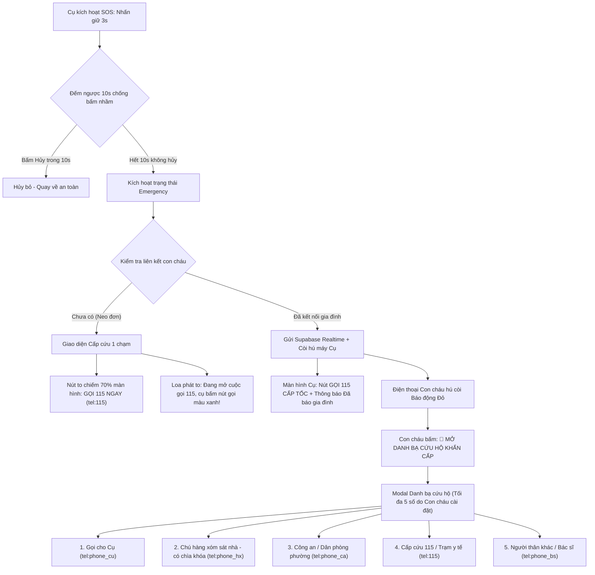

# Product Requirements Document (PRD): Cơ chế Báo động Khẩn cấp & Danh bạ SOS (Emergency & SOS System)

> Tài liệu đặc tả mở rộng cho hệ thống **SafeCheck**, tập trung vào phân tích nghiệp vụ kích hoạt báo động khẩn cấp (SOS), cơ chế điều hướng cuộc gọi tự động trên thiết bị di động, và quản lý danh bạ cứu hộ đa tầng (Emergency Directory) cho người cao tuổi và gia đình.

---

## 1. Tổng quan & Vấn đề Nghiệp vụ (Problem Statement)

### 1.1. Bối cảnh thực tế
- **Người cao tuổi gặp sự cố nguy cấp:** Khi đối mặt với sự cố nguy hiểm đến tính mạng (té ngã trong nhà tắm, đột quỵ, nhồi máu cơ tim, khó thở), thời gian vàng cấp cứu tính bằng giây. Họ không đủ minh mẫn và thị lực để bấm thoát ứng dụng, tìm biểu tượng "Điện thoại", mở bàn phím số rồi gõ `115`. Cần một cơ chế **1 chạm duy nhất** để đưa ngay số `115` vào màn hình quay số của điện thoại.
- **Sự cố ngay cả khi ĐÃ CÓ con cháu kết nối:**
  - Con cháu thường đi làm xa hoặc ở khác thành phố, không thể chạy về ngay lập tức.
  - Con cháu có thể đang bận họp, đang trên đường, hoặc đang ngủ say trong đêm không kịp bắt máy.
  - **Nguyên tắc cứu hộ tối thượng:** Dù đã có con cháu kết nối, trên màn hình của Cụ **bắt buộc vẫn phải có nút gọi ngay 115** để Cụ có thể chủ động gọi y tế khẩn cấp tại chỗ nếu nhận thấy tình trạng nguy kịch, không thể chỉ thụ động ngồi chờ con cháu liên hệ.
- **Nhu cầu phía Con cháu (Caregiver):** Khi nhận báo động đỏ từ Cụ, con cháu cần ngay một **"Danh bạ khẩn cấp cứu hộ" (Emergency SOS Directory)** gồm các lực lượng tại chỗ (chú hàng xóm có chìa khóa, công an phường, dân phòng, trạm y tế địa phương) để gọi ứng cứu ngay lập tức chỉ với 1 chạm.

---

## 2. Giải đáp Kỹ thuật: Cơ chế Thoát Web & Mở Ứng dụng Gọi điện (Dialer Mechanism)

### 2.1. Bản chất kỹ thuật trên Trình duyệt & Thiết bị di động
Khi phát triển bằng Web (React) và chạy trên trình duyệt (Chrome / Edge / Safari), trình duyệt **không có quyền tự ý bấm nút "Gọi" ngầm** mà không thông qua người dùng (đây là rào cản bảo mật chuẩn quốc tế của hệ điều hành iOS/Android để chống ứng dụng độc hại tự động gọi số mất phí).

Tuy nhiên, Web API cung cấp chuẩn giao thức gọi điện: **`tel:` URI Scheme** (RFC 3966).

```html
<!-- Cú pháp thẻ liên kết HTML -->
<a href="tel:115">GỌI CẤP CỨU 115</a>

<!-- Hoặc kích hoạt bằng JavaScript -->
<script>
  window.location.href = "tel:115";
</script>
```

### 2.2. Sự khác biệt giữa môi trường Máy tính (Desktop Chrome/Edge) và Điện thoại di động (Mobile)
| Môi trường | Hành vi khi kích hoạt `tel:115` | Giải thích |
| :--- | :--- | :--- |
| **Chrome/Edge trên Laptop/PC** (Môi trường đang dev) | Trình duyệt hiện popup hỏi: *"Open Pick an app?"* hoặc mở FaceTime (Mac), Phone Link / Skype (Windows), hoặc không phản ứng nếu máy tính không có phần mềm thoại. | Máy tính không có khe SIM / tính năng quay số GSM truyền thống. Đây là lý do khi test trên máy tính bạn cảm thấy "chưa thoát app và chưa vào bàn phím gọi". |
| **Chrome / Edge / Safari trên Điện thoại thật** (Android / iOS) | **Lập tức chuyển cửa sổ**: Ứng dụng điện thoại mặc định (Phone/Dialer) của Android/iOS mở lên ngay, số `115` đã được nhập sẵn trên bàn phím. Người dùng chỉ cần chạm nút gọi (màu xanh lá to bản của điện thoại) là kết nối tức thì. | Hệ điều hành bắt được giao thức `tel:`, tự động gọi intent `android.intent.action.DIAL` (trên Android) hoặc `tel:` prompt (trên iOS). |
| **PWA (Add to Home Screen) & Capacitor** | Hoạt động mượt mà ở chế độ toàn màn hình (Standalone), gọi Dialer hệ thống tức thì như một ứng dụng Native App hoàn chỉnh. | Tối ưu trải nghiệm như một ứng dụng gốc trên điện thoại. |

---

## 3. Mô hình Nghiệp vụ SOS Toàn diện (Dual SOS Architecture)



---

## 4. Chi tiết Nghiệp vụ & User Flows

### 4.1. Cơ chế kích hoạt SOS & Chống bấm nhầm (Anti-False Alarm)
1. **Thao tác kích hoạt:** Người cao tuổi nhấn và giữ nút "CẦN GIÚP ĐỠ (SOS)" trong **3 giây**.
2. **Khoảng đệm an toàn:** Màn hình chuyển sang chế độ đếm ngược **10 giây** (thay vì 5 giây, do người cao tuổi cần nhiều thời gian phản xạ hơn):
   - Màn hình hiển thị số đếm lùi `10... 9... 8...` cực lớn.
   - Phát âm thanh cảnh báo ngắt quãng *bíp... bíp...*.
   - Có nút lớn màu xám: **"BẤM ĐÂY ĐỂ HỦY (BẤM NHẦM)"**.
3. **Kích hoạt chính thức:** Sau 10 giây nếu Cụ không bấm Hủy, hệ thống chính thức kích hoạt trạng thái `Emergency`.

---

### 4.2. Giao diện & Hành vi phía Người lớn tuổi (Elderly Screen)

#### Kịch bản 1: Cụ neo đơn (Chưa có con cháu kết nối)
- Màn hình chuyển màu đỏ rực độ tương phản cao, hú còi tại chỗ.
- **Nút gọi duy nhất chiếm 70% không gian màn hình:**
  ```html
  <a href="tel:115" class="sos-giant-button">
    📞 BẤM ĐÂY GỌI 115 NGAY
  </a>
  ```
- **Hỗ trợ âm thanh (Text-to-Speech):** Loa ngoài phát: *"Đang mở cuộc gọi 115, cụ bấm nút gọi màu xanh trên màn hình nhé!"*.
- Nút phụ: "Tôi đã ổn / Tắt còi" (nhấn giữ 2s để xác nhận).

#### Kịch bản 2: Cụ ĐÃ CÓ con cháu kết nối
- Hệ thống bắn tín hiệu Realtime qua Supabase tới toàn bộ con cháu trong gia đình.
- Còi hú tại chỗ trên máy Cụ để người xung quanh hoặc hàng xóm nghe thấy.
- **Bắt buộc có nút Gọi ngay 115:** 
  - Mặc dù đã báo động tới con cháu, Cụ vẫn có thể đang gặp tình huống nguy kịch (khó thở cấp, nhồi máu cơ tim). Màn hình Cụ hiển thị song song:
    1. **Nút to nổi bật:** `📞 GỌI NGAY CẤP CỨU 115` (`tel:115`).
    2. **Hộp thông báo an tâm:** *"ĐÃ BÁO ĐỘNG TỚI CON CHÁU - Gia đình đang liên hệ với cụ!"*.
    3. **Nút xác nhận an toàn:** `🟢 TÔI ĐÃ AN TOÀN (TẮT CÒI)`.

---

### 4.3. Giao diện & Hành vi phía Con cháu (Caregiver Dashboard)

1. Khi Cụ kích hoạt SOS, toàn bộ con cháu trong nhóm gia đình nhận cảnh báo đỏ toàn màn hình kèm còi hú dồn dập.
2. Nổi bật trung tâm là nút: **"🚨 MỞ DANH BẠ CỨU HỘ KHẨN CẤP"**.
3. Khi bấm, mở **Emergency Contact Sheet** (Bảng danh bạ khẩn cấp tối đa 5 số):
   - **Thẻ 1 - Gọi cho Cụ:** Bấm để gọi ngay số điện thoại của Cụ xem Cụ có tỉnh táo không.
   - **Thẻ 2 - Hàng xóm sát vách:** Ví dụ *"Bác Tư (Hàng xóm - có chìa khóa)"*, bấm để gọi nhờ chạy qua xem ngay.
   - **Thẻ 3 - Công an / Dân phòng phường:** Gọi hỗ trợ khẩn cấp tại hiện trường.
   - **Thẻ 4 - Cấp cứu Y tế 115:** Gọi điều xe cứu thương.
   - **Thẻ 5 - Người thân dự phòng / Bác sĩ gia đình:** Số liên hệ bổ sung.
4. Mỗi thẻ hiển thị rõ: Tên, Quan hệ/Vai trò, Ghi chú, và nút Gọi thoại 1 chạm (`tel:...`).

---

## 5. Thiết kế Cơ sở Dữ liệu Supabase (Data Architecture)

### 5.1. Bảng `emergency_contacts` (Danh bạ Cứu hộ)

```sql
CREATE TYPE contact_category AS ENUM ('elderly', 'neighbor', 'relative', 'authority', 'medical');

CREATE TABLE public.emergency_contacts (
    id UUID PRIMARY KEY DEFAULT gen_random_uuid(),
    elderly_id UUID NOT NULL REFERENCES public.profiles(id) ON DELETE CASCADE,
    name VARCHAR(100) NOT NULL,            -- "Bác Tư (Hàng xóm)", "Công an Phường 3"
    phone VARCHAR(20) NOT NULL,             -- "0901234567" hoặc "115"
    contact_type contact_category NOT NULL DEFAULT 'neighbor',
    note VARCHAR(255),                      -- "Có chìa khóa dự phòng", "Trực 24/7"
    priority_order INT NOT NULL DEFAULT 1,  -- Thứ tự ưu tiên (1 đến 5)
    created_at TIMESTAMPTZ NOT NULL DEFAULT timezone('utc'::text, now()),
    updated_at TIMESTAMPTZ NOT NULL DEFAULT timezone('utc'::text, now())
);

-- Ràng buộc tối đa 5 số danh bạ cho mỗi Cụ (bảo đảm tính tinh gọn lúc khẩn cấp)
CREATE INDEX idx_emergency_contacts_elderly ON public.emergency_contacts(elderly_id, priority_order ASC);
```

### 5.2. Phân quyền dữ liệu Row Level Security (RLS)
- **Quyền đọc (SELECT):** 
  - Cụ sở hữu (`auth.uid() = elderly_id`).
  - Con cháu đã liên kết hợp lệ (`status = 'accepted'` trong bảng `family_links`).
- **Quyền ghi (INSERT / UPDATE / DELETE):**
  - **Chỉ Con cháu (`role = 'caregiver'` đã liên kết) mới có quyền thêm/sửa/xóa danh bạ.**
  - Người lớn tuổi không cần thao tác với form nhập liệu phức tạp để tránh nhầm lẫn.

```sql
-- Chính sách RLS cho con cháu quản lý danh bạ của Cụ
CREATE POLICY "Caregiver can manage elderly emergency contacts"
ON public.emergency_contacts
FOR ALL
USING (
    EXISTS (
        SELECT 1 FROM public.family_links fl
        WHERE fl.elderly_id = emergency_contacts.elderly_id
          AND fl.caregiver_id = auth.uid()
          AND fl.status = 'accepted'
    )
);

-- Chính sách cho Cụ đọc danh bạ của chính mình
CREATE POLICY "Elderly can view own emergency contacts"
ON public.emergency_contacts
FOR SELECT
USING (elderly_id = auth.uid());
```

---

## 6. Thiết kế Giao diện Quản lý Danh bạ (Caregiver Contact Management)

- **Vị trí:** Mục "Cài đặt Cứu hộ" trong Dashboard của Con cháu.
- **Tính năng CRUD:**
  - **Thêm mới:** Nút "+ Thêm liên hệ cứu hộ" (tối đa 5 liên hệ).
  - **Chỉnh sửa:** Cho phép sửa tên, số điện thoại, vai trò và ghi chú khi có người đổi số điện thoại.
  - **Xóa:** Xóa liên hệ không còn phù hợp.
  - **Sắp xếp thứ tự ưu tiên (1 - 5):** Kéo thả hoặc nút bấm lên/xuống để người ưu tiên nhất nằm trên cùng.

---

## 7. Kế hoạch Đóng gói PWA & Triển khai Di động (PWA Deployment Plan)

Thay vì phải trải qua quy trình phức tạp của App Store / Google Play, dự án triển khai theo mô hình **PWA (Progressive Web App)** tiêu chuẩn:

### 3 Bước triển khai thực tế:
1. **Bước 1: Cấu hình PWA trong mã nguồn:**
   - Tạo file `manifest.json` (tên app: "SafeCheck", theme color, chế độ `display: "standalone"`, icons các kích cỡ `192x192`, `512x512`).
   - Cấu hình file `vercel.json` định tuyến (rewrite) để hỗ trợ Single Page Application (SPA) trên Vercel.
2. **Bước 2: Deploy lên Vercel:**
   - Triển khai ứng dụng lên Vercel để nhận đường link bảo mật chuẩn HTTPS (`https://safecheck-xxx.vercel.app`).
   - *Yêu cầu HTTPS là bắt buộc để PWA và Web APIs (Service Worker, Haptic, Audio) hoạt động trên điện thoại di động.*
3. **Bước 3: Trải nghiệm trên Điện thoại di động:**
   - Dùng Chrome (Android) hoặc Safari (iOS) mở đường dẫn Vercel.
   - Nhấn **"Thêm vào màn hình chính" (Add to Home Screen)**.
   - Ứng dụng SafeCheck sẽ xuất hiện với icon riêng biệt ngoài màn hình điện thoại, khi mở lên sẽ chạy toàn màn hình (không có thanh địa chỉ web), hoạt động mượt mà và bấm nút SOS là chuyển sang bàn phím gọi điện thoại chuẩn xác 100%!

---

## 8. Bảng Tổng hợp Quyết định Thống nhất (Final Decisions)

| Hạng mục | Quyết định đã thống nhất | Rationale (Lý do nghiệp vụ) |
| :--- | :--- | :--- |
| **Thời gian đếm ngược chống bấm nhầm** | **10 giây** (thay vì 5 giây) | Người cao tuổi phản xạ chậm, tay run; 10s giúp Cụ đủ thời gian nhận thức và bấm nút Hủy nếu lỡ chạm nhầm. |
| **Nút gọi 115 trên máy Cụ** | **Luôn luôn xuất hiện** (kể cả khi đã có con cháu kết nối) | Trường hợp khẩn cấp cấp tính (ngất, đau tim, nghẹt thở) không thể ngồi chờ con cháu; Cụ cần quyền bấm gọi cấp cứu 115 ngay lập tức. |
| **Quyền quản lý danh bạ SOS** | **Chỉ Con cháu (Caregiver)** có quyền Thêm / Sửa / Xóa | Người lớn tuổi mắt kém, không nên thao tác gõ bàn phím nhập form danh bạ. |
| **Số lượng liên hệ cứu hộ** | **Tối đa 5 liên hệ** (có đầy đủ CRUD) | Đủ cho: Cụ, Hàng xóm, Công an, Cấp cứu 115, Bác sĩ/Người thân; không bị quá tải giao diện khi khẩn cấp. |
| **Hình thức đóng gói di động** | **PWA (Add to Home Screen) qua Vercel** | Triển khai nhanh, kiểm thử trực tiếp trên điện thoại thật không cần qua Store. |
