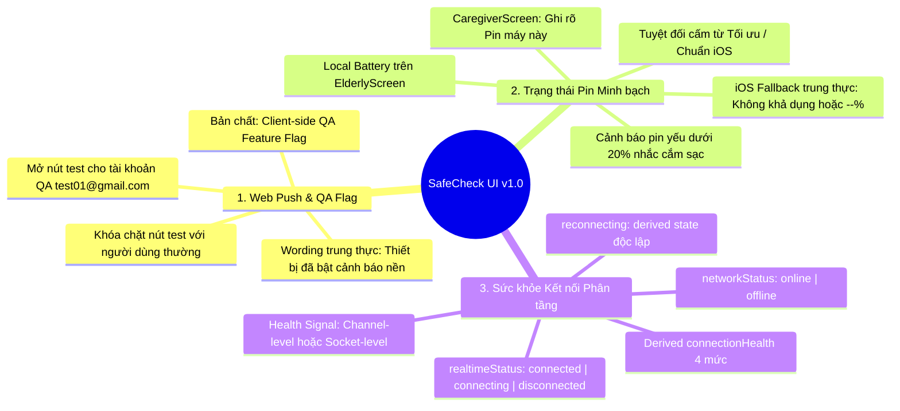
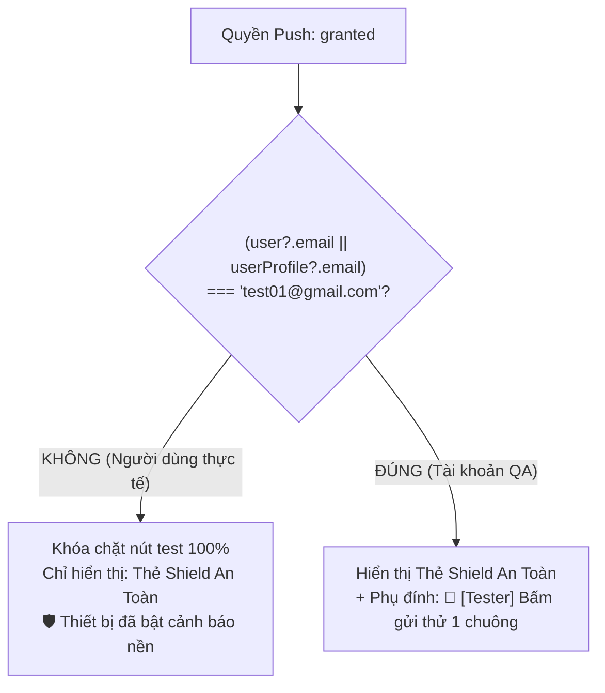

# Product Requirements Document (PRD): Tinh gọn UI & Chuẩn hóa Ngữ nghĩa Trạng thái Thực tế (Battery & Connection Health)

> **Tài liệu đặc tả nghiệp vụ UI v1.0 (Bản chốt hoàn thiện - Final Signed-off)** cho SafeCheck.  
> **Nguyên tắc thiết kế tối thượng:** *"UI tuyệt đối không được phát biểu một trạng thái mà hệ thống chưa thể xác thực hoặc bảo đảm."*  
> Tài liệu giải quyết rốt ráo 4 bài toán kiến trúc cốt lõi:
> 1. Định vị Client-side QA Feature Flag cho Tester (`test01@gmail.com`) & chuẩn hóa ngữ nghĩa Web Push (loại bỏ cam kết 24/7).
> 2. Khắc phục triệt để ngụy biện từ ngữ khi pin không đọc được trên iOS (loại bỏ "Tối ưu/Chuẩn iOS", thay bằng "--% / Không khả dụng").
> 3. Tách bạch 2 tầng abstraction của `realtimeStatus` (Channel-level vs Socket-level), làm rõ chu trình set `connecting`, và định nghĩa `reconnecting` là derived state.
> 4. Loại bỏ các tuyên bố mang tính tuyệt đối trong tài liệu; phân tầng tiêu chí nghiệm thu nghiệp vụ (Business Acceptance) và kỹ thuật (Technical Acceptance).

---

## 1. Triết lý Thiết kế & Định vị Bản chất Kỹ thuật (Design Philosophy & Foundations)

SafeCheck là ứng dụng công nghệ phục vụ **an toàn sinh mệnh và cứu trợ người cao tuổi**. Trong lĩnh vực này, bất kỳ thông tin hiển thị sai lệch nào cũng có thể tạo ra **cảm giác an tâm giả tạo (False Sense of Security)**, khiến người thân lơ là trong các tình huống hiểm nghèo.

```
┌──────────────────────────────────────────────────────────────────────────────────┐
│                   NGUYÊN TẮC THIẾT KẾ CỐT LÕI (SAFECHECK UI v1.0)                 │
│  "UI tuyệt đối không được phát biểu một trạng thái mà hệ thống chưa thể xác thực" │
└──────────────────────────────────────────────────────────────────────────────────┘
```

### 1.1. Định vị Tester Gating: Client-side QA Feature Flag (Không phải Security Boundary)
- **Bản chất kỹ thuật:**
  - Nút kiểm thử `data-testid="test-push-btn"` chỉ thực thi hàm `pushNotificationService.testLocalNotification()`. Hàm này phát một Web Notification **nội bộ cục bộ (Local Notification)** trên chính trình duyệt hiện tại.
  - Nút này **hoàn toàn không** gọi API backend phát tán push tới thiết bị người khác, do đó **không phải là một ranh giới bảo mật (Security Boundary)** và không có rủi ro leo thang đặc quyền (Privilege Escalation).
- **Mục đích UX:**
  - Việc ẩn nút này đối với người dùng thông thường và chỉ mở cho `test01@gmail.com` là một **Client-side Dev/QA Feature Flag**.
  - Mục đích duy nhất: **Bảo vệ tính tôn nghiêm của trải nghiệm người dùng cuối**, tránh để con cháu bấm nhầm gây hoang mang giữa chuông thử nghiệm và chuông SOS thật.
- **Ràng buộc triển khai:**
  - `isTester` ưu tiên xác định từ thông tin định danh người dùng đã xác thực (Authenticated User Identity: `session.user.email` hoặc `userProfile.email` được đồng bộ từ auth).
  - Đánh giá cờ: `isTester = (user?.email || userProfile?.email)?.toLowerCase() === 'test01@gmail.com'`.
  - Nếu `isTester === false`: Khóa chặt, không render component nút test vào DOM giao diện chính.

### 1.2. Chuẩn hóa Ngữ nghĩa Web Push (Permission $\neq$ Guaranteed Delivery)
- **Vấn đề ngữ nghĩa:** Việc trình duyệt cấp `permission === 'granted'` chỉ xác nhận hệ điều hành cho phép nhận tin. Nó không bảo đảm 100% tin nhắn sẽ phát chuông (thiết bị có thể mất sóng, cạn pin, hoặc rơi vào chế độ Không làm phiền DND).
- **Chuẩn hóa:**
  - ❌ *Tuyệt đối cấm dùng:* "Hệ thống đang bảo vệ 24/7", "Đang hoạt động 24/7".
  - ✅ *Chuyển sang:* **"Thiết bị đã bật cảnh báo nền"** kèm mô tả phụ: *"Sẵn sàng tiếp nhận tín hiệu SOS từ người thân khi có sự cố"*.

### 1.3. Khắc phục Semantic Flaw của Pin Fallback trên iOS
- **Sai lầm ngữ nghĩa cần loại bỏ:** Khi không đọc được pin trên iOS, việc hiển thị *"Pin: Tối ưu (iOS)"* hoặc *"Chuẩn iOS"* là đánh lừa thị giác người dùng. `batteryLevel = null` đơn giản là **"Trình duyệt không được phép đọc mức pin"**, hoàn toàn không có nghĩa là "Pin đang tối ưu hay pin khỏe". Nếu máy Cụ chỉ còn 3% pin sắp sập nguồn mà màn hình báo "Tối ưu", đây chính là sự vi phạm nguyên tắc cốt lõi về False Sense of Security!
- **Chuẩn hóa trung thực:**
  - ❌ *Cấm dùng:* "Tối ưu", "Chuẩn iOS", "Pin tốt".
  - ✅ *Chuyển sang:* **`Pin: Không khả dụng (iOS)`** hoặc **`Pin: --%`** (kèm icon pin xám và tooltip: *"Hệ điều hành iOS không công khai mức pin"*).

### 1.4. Bóc tách Kiến trúc: Pin Cục bộ (Local) vs Pin từ xa (Remote)
- **`LocalDeviceBattery` (Màn hình Cụ - [ElderlyScreen.tsx](file:///c:/Users/lhp14/learn_afterUni/SafeCheck/safecheck-app/src/components/ElderlyScreen.tsx)):**
  - Đọc trực tiếp phần cứng máy Cụ qua Battery API (nếu hỗ trợ).
  - Cảnh báo trực tiếp cho Cụ khi pin $\le 20\%$ và không cắm sạc: `🪫 Pin yếu (xx%), Cụ nhớ cắm sạc nhé!`.
- **`CaregiverScreen.tsx`:**
  - Trong giai đoạn UI v1.0 (khi chưa có pipeline đẩy pin máy Cụ qua Realtime/DB):
  - Thẻ trạng thái phải ghi rõ nhãn minh bạch: **`Pin máy này: xx%`** (để con cháu biết máy mình có đủ pin để trực tin cứu hộ hay không). Tuyệt đối không dùng pin máy con cháu rồi gán nhãn là pin của Cụ.

### 1.5. Định danh Tín hiệu Realtime (Realtime Health Signal)
- Trong kiến trúc SafeCheck, có 2 tầng kết nối với mức trừu tượng khác nhau (Abstraction Levels):
  1. **Tầng Kênh Nghiệp vụ (Channel-level State):** Kênh phòng `room-${activeFamilyCode}` — nơi đồng bộ trực tiếp các sự kiện điểm danh, SOS, Ping.
  2. **Tầng Socket Vận chuyển (Transport/Socket-level State):** `supabase.realtime` (Phoenix WebSocket client).
- **Quy ước định danh `realtimeStatus`:**
  - `realtimeStatus` được định nghĩa là **"Trạng thái kết nối Realtime được chọn làm health signal cho màn hình hiện tại"**.
  - **Khi đã kết nối gia đình (`activeFamilyCode !== null`):** Sử dụng trạng thái của kênh phòng `room-${activeFamilyCode}`. Khi kênh này nhận `SUBSCRIBED`, **kênh Realtime giữa thiết bị và Supabase đang được kết nối và sẵn sàng nhận dữ liệu realtime**.
  - **Khi chưa kết nối gia đình (`activeFamilyCode === null`):** Sử dụng trạng thái kết nối socket nền của Supabase (`supabase.realtime.isConnected()`).

---

## 2. Mục tiêu & Ma trận Trạng thái Hệ thống (System State Matrix)



### 2.1. Ma trận Trạng thái Kết nối Hợp nhất (`connectionHealth`)

$$\text{connectionHealth} = f(\text{networkStatus}, \text{realtimeStatus})$$

> [!NOTE]
> **Lưu ý kiến trúc quan trọng:** `reconnecting` là một **trạng thái suy luận (Derived State)** do SafeCheck tính toán (`network === 'online' && realtime === 'disconnected'`), không phải là một mã trạng thái trực tiếp từ Supabase SDK.

```typescript
export type NetworkStatus = 'online' | 'offline';
export type RealtimeStatus = 'connected' | 'connecting' | 'disconnected';
export type ConnectionHealth = 'healthy' | 'connecting' | 'reconnecting' | 'offline';

export function deriveConnectionHealth(
  network: NetworkStatus,
  realtime: RealtimeStatus
): ConnectionHealth {
  // 1. Mất mạng vật lý luôn là nguyên nhân gốc rễ
  if (network === 'offline') return 'offline';
  
  // 2. Có mạng và kênh/socket đã kết nối thành công
  if (realtime === 'connected') return 'healthy';
  
  // 3. Đang trong tiến trình bắt tay ban đầu
  if (realtime === 'connecting') return 'connecting';
  
  // 4. Mạng online nhưng WebSocket bị đứt gãy/timeout -> Derived state: reconnecting
  return 'reconnecting';
}
```

#### Chu trình Vòng đời của `realtimeStatus`:
1. **Bắt đầu gọi `channel.subscribe()`:** Gán ngay `realtimeStatus = 'connecting'`.
2. **Callback nhận `status === 'SUBSCRIBED'`:** Chuyển sang `realtimeStatus = 'connected'`.
3. **Callback nhận `status === 'CHANNEL_ERROR' | 'TIMED_OUT' | 'CLOSED'`:** Chuyển sang `realtimeStatus = 'disconnected'`.
4. Khi Supabase tự động tái kết nối, nếu nhận lại `SUBSCRIBED`, state tự động chuyển về `'connected'`.

#### Bảng Ánh xạ Hiển thị UI:
| `connectionHealth` | Nhãn Hiển Thị | Biểu Tượng & Màu Sắc | Trạng Thái Kỹ Thuật | Hành Vi Giao Diện |
| :--- | :--- | :---: | :--- | :--- |
| **`healthy`** | **Đã kết nối** | 🟢 `text-emerald-400` | Mạng online, kênh phòng `SUBSCRIBED` | Chấm xanh sáng tĩnh hoặc nhịp thở nhẹ, sẵn sàng nhận tin. |
| **`connecting`** | **Đang kết nối...** | 🟡 `text-amber-400 animate-pulse` | Mạng online, đang bắt tay kênh | Chấm vàng nhấp nháy, không chặn thao tác người dùng. |
| **`reconnecting`** | **Đang kết nối lại** | 🟠 `text-amber-500 animate-pulse` | Mạng online, WebSocket rớt (Derived) | Chấm cam nhấp nháy, hệ thống đang tự động retry. |
| **`offline`** | **Mất mạng (Offline)** | 🔴 `text-rose-400 font-bold` | `navigator.onLine === false` | Chấm đỏ cảnh báo nổi bật, nhắc kiểm tra WiFi/4G. |

---

## 3. Kiến trúc Kỹ thuật & Luồng Hoạt động (Technical Architecture)

### 3.1. Sơ đồ Cấu trúc Hook Phân tách Trách nhiệm (Separation of Concerns)

```
                       ┌─────────────────────────────────────┐
                       │               App.tsx               │
                       └──────────────────┬──────────────────┘
                                          │
            ┌─────────────────────────────┴─────────────────────────────┐
            ▼                                                           ▼
┌────────────────────────┐                                   ┌────────────────────────┐
│   useDeviceStatus()    │                                   │ Business Channels      │
│   (Local Diagnostics)  │                                   │ room-${activeCode}     │
└───────────┬────────────┘                                   └───────────┬────────────┘
            │                                                            │
    ┌───────┴───────────────┐                                            │
    ▼                       ▼                                            │ subscribe((status) => ...)
┌──────────────────┐  ┌──────────────────┐                               │   - Start: connecting
│ useBatteryStatus │  │ useNetworkStatus │                               │   - SUBSCRIBED: connected
│ - getBattery()   │  │ - onLine         │                               │   - ERROR/TIMEOUT: disconnected
│ - charging       │  │ - 'online' event │                               ▼
│ - null fallback  │  │ - 'offline' event│                      ┌─────────────────┐
└──────────────────┘  └──────────────────┘                      │ realtimeStatus  │
                                                                └────────┬────────┘
                                                                         │
                                                                         ▼
                                                            ┌─────────────────────────┐
                                                            │ deriveConnectionHealth  │
                                                            │ ──> connectionHealth    │
                                                            └─────────────────────────┘
```

### 3.2. Sơ đồ Luồng Phân quyền Nút Push Test (Tester QA Gating Flow)



---

## 4. Đặc tả Chi tiết Giao diện Người dùng (UI/UX Specifications)

### 4.1. Thẻ Cảnh Báo Nền trên Màn hình Con Cháu ([CaregiverScreen.tsx](file:///c:/Users/lhp14/learn_afterUni/SafeCheck/safecheck-app/src/components/CaregiverScreen.tsx))

```tsx
{pushPermission === 'granted' ? (
  <div className="space-y-2">
    {/* Thẻ trạng thái chuẩn mực ngữ nghĩa: KHÔNG dùng '24/7' hay 'Hệ thống bảo vệ' */}
    <div className="bg-emerald-950/40 border border-emerald-500/30 rounded-xl p-3 flex items-center gap-3 shadow-sm">
      <div className="w-8 h-8 rounded-lg bg-emerald-500/20 border border-emerald-500/40 flex items-center justify-center text-emerald-400 text-base shrink-0">
        🛡️
      </div>
      <div className="flex-1 min-w-0">
        <div className="flex items-center gap-1.5">
          <span className="w-2 h-2 rounded-full bg-emerald-400 animate-pulse"></span>
          <span className="text-xs font-bold text-emerald-300">Thiết bị đã bật cảnh báo nền</span>
        </div>
        <p className="text-[10px] text-slate-400 truncate mt-0.5">
          Sẵn sàng tiếp nhận tín hiệu SOS từ {elderlyName} khi có sự cố
        </p>
      </div>
    </div>

    {/* Nút test kiểm thử: ĐẶC BIỆT KHÓA CHẶT, CHỈ HIỂN THỊ KHI LÀ TESTER (test01@gmail.com) */}
    {isTester && (
      <div className="pt-1">
        <button
          type="button"
          data-testid="test-push-btn"
          onClick={async () => {
            setPushStatusMessage('Đang phát chuông thử nghiệm...');
            const res = await pushNotificationService.testLocalNotification();
            setPushStatusMessage(res.message);
          }}
          className="w-full py-2 bg-slate-800/80 hover:bg-slate-700 active:scale-95 text-indigo-300 font-mono text-[10px] rounded-xl border border-indigo-500/30 transition-all flex items-center justify-center gap-1.5 shadow-sm"
        >
          <span>🧪 [Tester] Bấm gửi thử 1 chuông thông báo</span>
        </button>
        {pushStatusMessage && (
          <p className="text-[10px] text-indigo-300 mt-1 text-center animate-pulse font-mono">
            {pushStatusMessage}
          </p>
        )}
      </div>
    )}
  </div>
) : ...}
```

### 4.2. Thẻ Trạng thái Hệ thống & Pin ([CaregiverScreen.tsx](file:///c:/Users/lhp14/learn_afterUni/SafeCheck/safecheck-app/src/components/CaregiverScreen.tsx))

```tsx
<div className="bg-slate-900/90 rounded-2xl p-3 mb-4 flex justify-around items-center text-xs text-slate-300 border border-slate-800 shadow-inner">
  {/* Pin cục bộ con cháu - Minh bạch nguồn gốc, không fake thông tin */}
  <div className="flex items-center gap-1.5">
    <span>{isCharging ? '⚡' : '🔋'}</span>
    <span>Pin máy này:</span>
    <strong className={batteryLevel !== null && batteryLevel <= 20 ? "text-rose-400 font-bold animate-pulse" : "text-white font-bold"}>
      {batteryLevel !== null ? `${batteryLevel}%` : 'Không khả dụng (iOS)'}
    </strong>
  </div>

  <div className="text-slate-700">|</div>

  {/* Trạng thái kết nối suy luận từ ConnectionHealth */}
  <div className="flex items-center gap-1.5">
    <span className={`w-2 h-2 rounded-full ${
      connectionHealth === 'healthy'
        ? 'bg-emerald-400 shadow-[0_0_8px_rgba(52,211,153,0.6)]'
        : connectionHealth === 'connecting'
        ? 'bg-amber-400 animate-ping'
        : connectionHealth === 'reconnecting'
        ? 'bg-amber-500 animate-pulse'
        : 'bg-rose-500 animate-pulse'
    }`} />
    <span>Kết nối:</span>
    <strong className={
      connectionHealth === 'healthy'
        ? 'text-emerald-400 font-bold'
        : connectionHealth === 'connecting'
        ? 'text-amber-400 font-bold'
        : connectionHealth === 'reconnecting'
        ? 'text-amber-500 font-bold'
        : 'text-rose-400 font-bold'
    }>
      {connectionHealth === 'healthy'
        ? 'Đã kết nối'
        : connectionHealth === 'connecting'
        ? 'Đang kết nối...'
        : connectionHealth === 'reconnecting'
        ? 'Đang kết nối lại'
        : 'Mất mạng (Offline)'}
    </strong>
  </div>
</div>
```

### 4.3. Header Trạng thái trên Màn hình Cụ ([ElderlyScreen.tsx](file:///c:/Users/lhp14/learn_afterUni/SafeCheck/safecheck-app/src/components/ElderlyScreen.tsx))

```tsx
<div className="flex items-center gap-1.5">
  {isCharging && <span className="text-amber-400 text-xs">⚡</span>}
  <span className={`text-xs ${
    batteryLevel !== null && batteryLevel <= 20 && !isCharging
      ? 'text-rose-400 font-black animate-pulse'
      : 'text-slate-300 font-medium'
  }`}>
    {batteryLevel !== null 
      ? `Pin: ${batteryLevel}%` 
      : 'Pin: --%'}
  </span>
  {batteryLevel !== null && batteryLevel <= 20 && !isCharging && (
    <span className="text-[10px] text-rose-400 font-bold ml-1">
      (Cụ nhớ cắm sạc)
    </span>
  )}
</div>
```

---

## 5. Kế hoạch Triển khai Kỹ thuật (Implementation Plan)

### Giai đoạn 1: Xây dựng các Hooks Đơn nhiệm Chuyên trách
1. **`src/hooks/useBatteryStatus.ts`:**
   - Kiểm tra `'getBattery' in navigator`.
   - Lắng nghe `levelchange`, `chargingchange`.
   - Trả về `{ batteryLevel: number | null, isCharging: boolean, isSupported: boolean }`.
2. **`src/hooks/useNetworkStatus.ts`:**
   - Khởi tạo từ `navigator.onLine`.
   - Lắng nghe `window.addEventListener('online')` và `window.addEventListener('offline')`.
   - Trả về `networkStatus: 'online' | 'offline'`.
3. **`src/hooks/useDeviceStatus.ts`:**
   - Kết hợp `useBatteryStatus` và `useNetworkStatus`.
   - Trả về `{ batteryLevel, isCharging, isBatterySupported, networkStatus }`.

### Giai đoạn 2: Giám sát Kênh Realtime Đại diện trong [App.tsx](file:///c:/Users/lhp14/learn_afterUni/SafeCheck/safecheck-app/src/App.tsx)
- Quản lý state `realtimeStatus: 'connected' | 'connecting' | 'disconnected'`.
- Khi thiết lập kênh `supabase.channel('room-${activeFamilyCode}')`:
  - Trước khi gọi `.subscribe()`: Set ngay `realtimeStatus = 'connecting'`.
  - Trong callback `.subscribe((status) => ...)`:
    - Nếu `status === 'SUBSCRIBED'` $\rightarrow$ set `'connected'`.
    - Nếu `status === 'CHANNEL_ERROR' || status === 'TIMED_OUT' || status === 'CLOSED'` $\rightarrow$ set `'disconnected'`.
- Khi `activeFamilyCode === null` (chưa ghép nối):
  - Kiểm tra `supabase.realtime.isConnected()` để xác định trạng thái kết nối socket nền (`'connected'` hoặc `'connecting'`).
- Suy luận `connectionHealth = deriveConnectionHealth(networkStatus, realtimeStatus)`.
- Xác định `isTester`:
  - `const isTester = (userProfile?.email || '')?.toLowerCase() === 'test01@gmail.com'`.
- Truyền `connectionHealth`, `batteryLevel`, `isCharging`, `isTester` xuống các components con.

### Giai đoạn 3: Cập nhật [CaregiverScreen.tsx](file:///c:/Users/lhp14/learn_afterUni/SafeCheck/safecheck-app/src/components/CaregiverScreen.tsx)
- Áp dụng wording mới: *"Thiết bị đã bật cảnh báo nền"*.
- Bọc nút `test-push-btn` bằng `{isTester && (...)}`.
- Cập nhật thẻ trạng thái hệ thống: hiển thị `Pin máy này` và `connectionHealth`.

### Giai đoạn 4: Cập nhật [ElderlyScreen.tsx](file:///c:/Users/lhp14/learn_afterUni/SafeCheck/safecheck-app/src/components/ElderlyScreen.tsx)
- Nhận `batteryLevel`, `isCharging`.
- Hiển thị mức pin thực tế, icon `⚡`, fallback `--%` khi không hỗ trợ, và cảnh báo pin yếu $\le 20\%$.

---

## 6. Tiêu chí Nghiệm thu Phân tầng (Dual-Layer Acceptance Criteria)

### 6.1. Tiêu chí Nghiệm thu Nghiệp vụ (Business Acceptance Criteria)
Mục tiêu: Đảm bảo tính an toàn, trung thực và loại trừ hoàn toàn False Sense of Security đối với người dùng cuối.

- [ ] **Tính Trang trọng & Bảo vệ Ngữ cảnh Người dùng Thật:**
  - Người dùng gia đình thông thường khi sử dụng app hoàn toàn không bị rối mắt bởi nút thử nghiệm lập trình (`test-push-btn`).
  - Khi đã bật thông báo, giao diện thể hiện sự an tâm chừng mực: *"Thiết bị đã bật cảnh báo nền"*, tuyệt đối không hứa hẹn phi thực tế ("24/7", "Chắc chắn phát chuông").
- [ ] **Tính Hữu dụng của Tài khoản Kiểm thử (QA Testing):**
  - Tài khoản tester (`test01@gmail.com`) có nút kiểm tra chuyên dụng để verify âm thanh và biểu ngữ thông báo đẩy tại chỗ mà không cần phải thực hiện một ca cấp cứu SOS giả.
- [ ] **Tính Trung thực về Chỉ số Pin:**
  - Cụ bà nhìn thấy đúng % pin điện thoại của mình. Khi pin yếu $\le 20\%$, có nhắc nhở trực quan để Cụ nhớ cắm sạc.
  - Trên thiết bị không thể đọc được pin (iOS), giao diện thể hiện rõ sự bất khả tri (`--%` hoặc `Không khả dụng`), tuyệt đối không ru ngủ người dùng bằng từ "Tối ưu" hay con số 85% giả tạo.
  - Con cháu hiểu rõ chỉ số pin trên màn hình của mình là pin thiết bị giám sát của chính họ (`Pin máy này`), không bị ngộ nhận là pin của Cụ ở quê.
- [ ] **Tính Đáng tin cậy của Trạng thái Kết nối:**
  - UI phản ánh trung thực trạng thái mạng và kết nối Realtime mà thiết bị quan sát được tại thời điểm hiện tại thông qua chỉ báo `connectionHealth`.
  - Khi mất kết nối mạng 4G/WiFi, giao diện chuyển sang cảnh báo đỏ kịp thời thay vì tiếp tục hiển thị trạng thái "Đã kết nối" giả tạo.

---

### 6.2. Tiêu chí Nghiệm thu Kỹ thuật (Technical Implementation Acceptance)
Mục tiêu: Đảm bảo code sạch, mô-đun hóa đúng đắn, xử lý ngoại lệ mượt mà và không gây regression.

- [ ] **Mô-đun Hooks Hoạt động Độc lập:**
  - `useBatteryStatus`: Chạy mượt mà trên Chromium (Chrome, Edge, Samsung Internet) với các event listener `levelchange`, `chargingchange`. Bắt `try...catch` an toàn trên môi trường SSR hoặc trình duyệt không hỗ trợ.
  - `useNetworkStatus`: Phản ứng tức thì với các event `online` và `offline` của `window`.
  - `useDeviceStatus`: Kết hợp các hooks con một cách thuần túy, không tạo re-render thừa và không can thiệp vào lifecycle của Realtime channels.
- [ ] **Kênh Health Channel & Suy luận `connectionHealth`:**
  - Kênh `room-${activeFamilyCode}` cập nhật đúng `realtimeStatus` thông qua chu trình: khởi tạo đặt `'connecting'`, nhận `SUBSCRIBED` đặt `'connected'`, lỗi/timeout đặt `'disconnected'`.
  - Hàm `deriveConnectionHealth` trả về đúng 4 trạng thái theo bảng ma trận nghiệp vụ, trong đó `reconnecting` được xác định là trạng thái suy luận.
- [ ] **Kiểm thử Ngoại tuyến (Offline Simulation):**
  - Khi bật tính năng `Offline` trong Chrome DevTools Network Tab: `connectionHealth` chuyển tức thì sang `offline` (`Mất mạng (Offline)`).
  - Khi tắt `Offline` (chuyển về Online): Sau khi mạng trở lại, hệ thống tự động thử kết nối lại và UI chuyển về `healthy` (`Đã kết nối`) khi channel thực sự nhận trạng thái `SUBSCRIBED`, không yêu cầu reload trang.
- [ ] **Khóa Chặt Nút Push Test theo Đúng Flag:**
  - Giao diện render kiểm thử:
    - Khi tài khoản là người dùng thông thường (`userProfile.email = 'conchau@gmail.com'`): `queryByTestId('test-push-btn')` phải trả về `null`.
    - Khi tài khoản là tester (`userProfile.email = 'test01@gmail.com'`): `getByTestId('test-push-btn')` hiển thị và bấm kích hoạt thông báo thành công.
