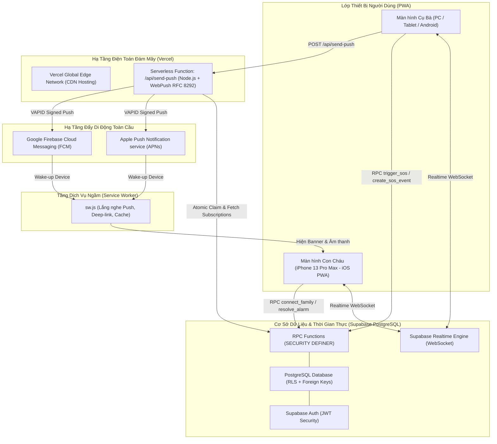

# BÁO CÁO TỔNG KẾT & KỊCH BẢN THUYẾT TRÌNH DỰ ÁN SAFECHECK
> **Giải pháp Bảo vệ An toàn và Kết nối Khẩn cấp 1 Chạm cho Người Cao Tuổi**  
> *Ngày lập báo cáo: 12/09/2026*  
> *Tác giả: Nhóm Phát triển SafeCheck*  
> *Mã nguồn & Triển khai: React + TypeScript + Supabase + Vercel + Web Push (Apple APNs/FCM)*

---

## MỤC LỤC
1. [TỔNG QUAN DỰ ÁN & VẤN ĐỀ XÃ HỘI](#1-tổng-quan-dự-án--vấn-đề-xã-hội)
2. [HỆ THỐNG TÍNH NĂNG ĐÃ HOÀN THIỆN (DELIVERED FEATURES)](#2-hệ-thống-tính-năng-đã-hoàn-thiện-delivered-features)
3. [KIẾN TRÚC KỸ THUẬT & CÔNG NGHỆ NỀN TẢNG](#3-kiến-trúc-kỹ-thuật--công-nghệ-nền-tảng)
4. [KỊCH BẢN THUYẾT TRÌNH & TRÌNH DIỄN (DEMO SCRIPT)](#4-kịch-bản-thuyết-trình--trình-diễn-demo-script)
5. [PHÂN TÍCH CHIẾN LƯỢC SWOT (ĐIỂM HAY & ĐIỂM DỞ)](#5-phân-tích-chiến-lược-swot-điểm-hay--điểm-dở)
6. [LỘ TRÌNH PHÁT TRIỂN TIẾP THEO (PRODUCT ROADMAP)](#6-lộ-trình-phát-triển-tiếp-theo-product-roadmap)

---

## 1. TỔNG QUAN DỰ ÁN & VẤN ĐỀ XÃ HỘI

### 1.1. Bối cảnh & Vấn đề Thực tế (Problem Statement)
* **Xu hướng già hóa dân số:** Ngày càng nhiều người cao tuổi tại Việt Nam sống một mình hoặc ở nhà một mình ban ngày khi con cháu đi làm xa.
* **Nguy cơ tiềm ẩn:** Đột quỵ, tai biến, té ngã trong nhà tắm là những tai nạn phổ biến. Trong cấp cứu y tế, **"thời gian vàng" (30 - 60 phút đầu)** quyết định sinh mạng. Rất nhiều trường hợp đau lòng xảy ra chỉ vì người thân không phát hiện kịp thời.
* **Rào cản công nghệ đối với người già:**
  - Smartphone hiện đại quá phức tạp: Quá nhiều icon, thao tác vuốt chạm phức tạp, mật khẩu khó nhớ, chữ quá nhỏ.
  - Người già mắt kém, tay run, khi gặp nguy hiểm không thể mở danh bạ để tìm số gọi.
* **Tâm lý con cháu:** Luôn trong trạng thái bất an, thỉnh thoảng gọi điện hỏi thăm nhưng sợ làm phiền giấc ngủ của cha mẹ.

### 1.2. Sứ mệnh & Giải pháp SafeCheck
**SafeCheck ra đời với triết lý: "Tối giản cho Cụ - Yên tâm cho Con".**
* **Với Cụ bà:** Chỉ cần **1 chạm duy nhất** vào buổi sáng để báo bình an, giao diện siêu lớn, phản hồi bằng giọng nói và độ rung. Khi khẩn cấp: Nhấn giữ nút đỏ 3 giây.
* **Với Con cháu:** Bảng điều khiển thời gian thực (Realtime Dashboard), nhận thông báo đẩy tức thì trên màn hình khóa điện thoại (kể cả khi tắt máy/khóa màn hình), chuông còi báo động khẩn cấp và danh bạ cứu hộ 1 chạm.

---

## 2. HỆ THỐNG TÍNH NĂNG ĐÃ HOÀN THIỆN (DELIVERED FEATURES)

Dựa trên các tài liệu đặc tả nghiệp vụ (`PRD.md`, `PRD_AUTH_FAMILY.md`, `PRD_SOS.md`, `PRD_NotiSOS.md`), toàn bộ các tính năng sau đã được hiện thực hóa và kiểm thử tự động 100%:

### 2.1. Điểm danh An tâm 1 Chạm (Daily Check-in)
* **Nút bấm khổng lồ:** Chiếm trọn trung tâm màn hình Cụ, chữ to tương phản cao (*"HÔM NAY TÔI ỔN"*).
* **Phản hồi đa giác quan (Sensory Feedback):**
  - **Xúc giác:** Rung máy (Haptic Feedback) xác nhận lệnh.
  - **Thính giác:** Giọng đọc tiếng Việt tự nhiên (*"Điểm danh thành công, con cháu đã nhận được tin"*).
  - **Thị giác:** Đổi sang thẻ màu xanh ngọc bích an lành, lưu vết giờ điểm danh chính xác.
* **Khóa nút chống bấm nhầm:** Sau khi điểm danh, hệ thống tự động khóa nút để tránh cụ bấm nhiều lần gây nhiễu.

### 2.2. Máy trạng thái Tự động (State Machine Engine)
Hệ thống vận hành dựa trên máy trạng thái chuẩn mực:
* `Waiting` (Chờ điểm danh sáng 07:00 - 09:00).
* `Safe` (Đã điểm danh thành công).
* `Late` (Quá 09:00 chưa điểm danh $\rightarrow$ Bắn cảnh báo vàng nhắc nhở con cháu).
* `Emergency` (Quá hạn 30 phút hoặc Cụ bấm SOS $\rightarrow$ Còi hú đỏ toàn diện).
* `Ping_Requested` (Con cháu chủ động bấm chuông hỏi thăm).

### 2.3. Tính năng "Ping An Tâm" Đột xuất (Check-on-Demand)
* Khi con cháu lo lắng, có thể bấm nút **"Gửi chuông kiểm tra (Ping)"** trên Dashboard.
* Máy Cụ lập tức reo chuông vui tươi (Ding-Dong) và phát giọng nói: *"Con cháu đang hỏi thăm, Cụ hãy chạm vào màn hình để con yên tâm nhé"*.
* Màn hình chuyển sang nút vàng lớn: *"BẤM ĐỂ CON YÊN TÂM"*.
* **Cơ chế chống spam:** Nút Ping có thời gian hồi chiêu (Cooldown) 15 phút.

### 2.4. Báo động Đỏ SOS & Quy trình Chống Bấm Nhầm
* **Kích hoạt khẩn cấp:** Nút SOS màu đỏ viền phát sáng, yêu cầu **nhấn giữ 3 giây**.
* **Đếm ngược an toàn 10 giây:** Tránh trường hợp Cụ vô tình đè tay vào máy. Màn hình hiện số đếm ngược khổng lồ và nút *"HỦY BÁO ĐỘNG"* to bản.
* **Khi kích hoạt thành công:**
  - Máy Cụ: Bật chế độ khẩn cấp, hiển thị nút gọi nhanh cấp cứu **115**.
  - Máy Con: Còi hú cứu thương inh ỏi, màn hình nhấp nháy đỏ rực.
  - Tích hợp **Danh bạ Cứu hộ Khẩn cấp**: Thẻ thông tin hàng xóm, tổ trưởng dân phố, trạm y tế lân cận.

### 2.5. Phân quyền & Ghép nối Gia đình Đa người chăm sóc (1:N)
* **Xác thực phi máy chủ:** Đăng nhập bằng Email/Số điện thoại an toàn qua Supabase Auth.
* **Mã kết nối động 6 ký tự (`Pairing Code`):** Mỗi Cụ sở hữu một mã riêng biệt hiển thị ở góc màn hình.
* **Mô hình 1:N:** Một Cụ có thể kết nối đồng thời với nhiều người con, người cháu. Tất cả con cháu đều nhận được thông báo đồng bộ cùng lúc.
* **Bảo mật cấp hàng (RLS):** Con cháu nhà nào chỉ được xem dữ liệu người thân nhà đó, tuyệt đối cô lập thông tin.

### 2.6. Thông báo Đẩy Ngoại tuyến Đánh thức Thiết bị (Offline Web Push via APNs)
* **Giải quyết "điểm mù" di động:** Khi con cháu khóa màn hình iPhone hoặc đang chơi game/lướt mạng xã hội, luồng WebSocket bị iOS đóng băng.
* **Công nghệ Web Push chuẩn W3C:** Máy chủ Vercel Serverless Function gửi tín hiệu qua **Apple Push Notification service (APNs)** hoặc **Google FCM**.
* **Trải nghiệm thực tế:** Màn hình khóa iPhone tự động sáng đèn, phát chuông báo động và thả banner đỏ: *"🚨 SafeCheck - BÁO ĐỘNG SOS KHẨN CẤP!"*.
* **Deep-link 1 chạm:** Chạm vào biểu ngữ trên màn hình khóa $\rightarrow$ Ứng dụng mở ra ngay lập tức và điều hướng thẳng vào phòng cấp cứu của Cụ.

---

## 3. KIẾN TRÚC KỸ THUẬT & CÔNG NGHỆ NỀN TẢNG



### Thông số Công nghệ Chi tiết:
* **Frontend:** React 18, TypeScript, Tailwind CSS, Lucide Icons, Vite.
* **Progressive Web App (PWA):** Web App Manifest độc lập, Service Worker tùy biến, Retina App Icon (`apple-touch-icon.png`).
* **Âm thanh & Phản hồi:** Web Audio API (bộ dao động điện tử giả lập còi hú cứu thương liên tục không cần tải file mp3), Web Speech Synthesis API (giọng đọc trợ lý ảo tiếng Việt).
* **Backend & Cơ sở dữ liệu:** Supabase PostgreSQL với 8 hàm thủ tục nghiệp vụ (`connect_family`, `request_ping`, `resolve_alarm`, `create_sos_event`, `claim_sos_push_dispatch`...).
* **Kiểm thử Tự động:** Playwright E2E Test Suite gồm **29 kịch bản kiểm thử toàn diện** chạy trên Chromium, WebKit và Mobile Emulation.

---

## 4. KỊCH BẢN THUYẾT TRÌNH & TRÌNH DIỄN (DEMO SCRIPT)

> **Thời lượng gợi ý:** 7 - 10 phút.  
> **Thiết bị chuẩn bị:** 
> - 1 Laptop (Mở màn hình Cụ bà trên trình duyệt web).
> - 1 iPhone (Đã cài PWA SafeCheck lên Màn hình chính, đăng nhập tài khoản Con cháu).

---

### PHẦN 1: MỞ ĐẦU - ĐẶT VẤN ĐỀ & CHẠM CẢM XÚC (1.5 phút)
* **Người trình bày (Speaker):**
  > *"Kính thưa quý vị và các bạn, hãy tưởng tượng một buổi sáng bận rộn tại văn phòng. Chúng ta lao vào những cuộc họp, deadline và chuông điện thoại. Nhưng ở một góc khác, cha mẹ hay ông bà của chúng ta đang ở nhà một mình. Một cú trượt chân trong phòng tắm, một cơn tức ngực đột ngột... và các cụ không thể nào với tới chiếc điện thoại thông minh đầy những icon phức tạp để gọi cho chúng ta.*  
  > *Nỗi lo lắng ấy là lý do dự án **SafeCheck** ra đời. SafeCheck không chỉ là một ứng dụng, mà là chiếc cầu nối an tâm 1 chạm giữa hai thế hệ."*

---

### PHẦN 2: DEMO CẢNH 1 - ĐIỂM DANH BUỔI SÁNG AN LÀNH (2 phút)
* **Thao tác:** Hướng mắt khán giả lên màn hình Laptop (Màn hình Cụ).
* **Lời dẫn:**
  > *"Mỗi sáng thức dậy, Cụ chỉ cần làm đúng một thao tác duy nhất."*
* **Thao tác Demo:** Dùng chuột chạm vào nút lớn **"HÔM NAY TÔI ỔN"**.
* **Hiệu ứng diễn ra:**
  - Loa phát ra giọng nói trầm ấm: *"Điểm danh thành công, con cháu đã nhận được tin"*.
  - Máy rung nhẹ và nút chuyển sang màu xanh lá ngọc bích ghi rõ giờ điểm danh.
* **Chuyển sang điện thoại Con cháu:**
  - Trên màn hình iPhone của con, thẻ trạng thái của Cụ lập tức chuyển sang màu xanh **"An toàn"** theo thời gian thực (độ trễ dưới 0.5 giây).
* **Điểm nhấn:** Không cần nhắn tin hỏi *"Cụ ăn sáng chưa?"*, con cháu chỉ cần lướt mắt qua là trút bỏ được 100% gánh nặng âu lo.

---

### PHẦN 3: DEMO CẢNH 2 - TÍNH NĂNG "PING AN TÂM" ĐỘT XUẤT (2 phút)
* **Lời dẫn:**
  > *"Đến chiều, con cháu bỗng thấy sốt ruột vì gọi điện không bắt máy (có thể cụ để quên điện thoại trong phòng ngủ). Con cháu không cần hoảng loạn chạy về nhà ngay, mà dùng tính năng 'Ping an tâm'."*
* **Thao tác Demo:** Trên iPhone của con, bấm nút **"Gửi chuông kiểm tra (Ping)"**.
* **Hiệu ứng diễn ra:**
  - Máy Laptop của Cụ lập tức reo chuông chuông Ding-Dong vui tươi và phát giọng nói: *"Con cháu đang hỏi thăm, Cụ hãy chạm vào màn hình để con yên tâm nhé"*.
  - Nút chuyển sang màu vàng tươi: *"BẤM ĐỂ CON YÊN TÂM"*.
  - Cụ chạm vào nút $\rightarrow$ Màn hình con cháu lập tức nhận được thông báo phản hồi, xóa tan mọi nghi ngờ lo lắng.

---

### PHẦN 4: DEMO CẢNH 3 - ĐỈNH ĐIỂM: BÁO ĐỘNG ĐỎ SOS & ĐÁNH THỨC IPHONE NGOẠI TUYẾN (3 phút)
* **Lời dẫn:**
  > *"Bây giờ là tình huống nguy cấp nhất. Con cháu đã khóa màn hình điện thoại, đút túi quần hoặc đang đi ngoài đường."*
* **Thao tác chuẩn bị:** **Khóa màn hình iPhone** (màn hình đen hoàn toàn, đặt trên bàn trước mặt khán giả).
* **Thao tác trên máy Cụ:** Nhấn và giữ nút đỏ **"CẦN GIÚP ĐỠ (GIỮ 3 GIÂY)"**.
* **Hiệu ứng chống bấm nhầm:** Màn hình đếm ngược 10... 9... 8...
* **Thời khắc kích hoạt (khi đếm về 0):**
  - **MÁY TÍNH CỤ:** Bật đèn đỏ chớp nháy, hiển thị nút bấm gọi ngay **115**.
  - **ĐIỆN THOẠI IPHONE CỦA CON (ĐANG TẮT MÀN HÌNH):**
    👉 **Màn hình khóa iPhone lập tức BẬT SÁNG ĐÈN!**  
    👉 **Rung chuông liên hồi và hiện biểu ngữ đỏ: '🚨 SafeCheck - BÁO ĐỘNG SOS KHẨN CẤP! Cụ vừa kích hoạt báo động cứu hộ!'**
* **Thao tác tiếp ứng:** Con cháu cầm iPhone lên, chạm vào thông báo:
  - Ứng dụng SafeCheck mở ra ngay lập tức (Deep-link).
  - Loa điện thoại hú còi cứu thương dồn dập.
  - Hiện ngay bảng **Danh bạ Hàng xóm & Trạm Y tế** để gọi cứu viện ngay tức khắc!
* **Kết thúc tình huống:** Bấm *"Xác nhận an toàn / Tắt báo động"* $\rightarrow$ Còi tắt, hệ thống trở lại bình yên.

---

### PHẦN 5: TỔNG KẾT & THÔNG ĐIỆP (1.5 phút)
* **Lời kết:**
  > *"SafeCheck không bán một phần mềm, chúng tôi cung cấp **sự an tâm tuyệt đối** cho mỗi gia đình Việt Nam. Công nghệ hiện đại nhất chỉ có giá trị khi nó phục vụ được những người yếu thế nhất trong xã hội."*

---

## 5. PHÂN TÍCH CHIẾN LƯỢC SWOT (ĐIỂM HAY & ĐIỂM DỞ)

Bảng phân tích toàn diện về nội lực và ngoại cảnh của dự án SafeCheck ở thời điểm hiện tại:

```
                  ┌─────────────────────────────────────────────────────────┐
                  │                    MA TRẬN S.W.O.T                      │
                  └─────────────────────────────────────────────────────────┘
                   
           STRENGTHS (Điểm mạnh)                     WEAKNESSES (Điểm hạn chế)
  ┌─────────────────────────────────────────┐ ┌─────────────────────────────────────────┐
  │ • UX lão khoa cực đoan (Zero-friction)  │ │ • Phụ thuộc vào kết nối Internet        │
  │ • Phản hồi đa giác quan (Voice, Haptic) │ │ • Chưa có GPS định vị tọa độ thời gian  │
  │ • Đánh thức màn hình khóa (Apple APNs)  │ │ • Cần thao tác 'Thêm vào MH chính' iOS  │
  │ • Chi phí vận hành hạ tầng $0           │ │ • Chưa có cảm biến tự động té ngã       │
  │ • Kiến trúc bảo mật đa lớp (RLS + RPC)  │ │                                         │
  └─────────────────────────────────────────┘ └─────────────────────────────────────────┘
  
         OPPORTUNITIES (Cơ hội)                         THREATS (Thách thức)
  ┌─────────────────────────────────────────┐ ┌─────────────────────────────────────────┐
  │ • Tốc độ già hóa dân số tăng nhanh      │ │ • Rào cản thói quen người già quên sạc  │
  │ • Hợp tác với các viện dưỡng lão/y tế   │ │ • Apple/Google siết chặt chính sách PWA │
  │ • Tích hợp thiết bị IoT (Vòng tay/Nút)  │ │ • Cạnh tranh từ tính năng SOS của Apple │
  │ • Mô hình B2B / B2C Freemium tiềm năng  │ │                                         │
  └─────────────────────────────────────────┘ └─────────────────────────────────────────┘
```

### 5.1. STRENGTHS (Điểm mạnh / Điểm hay độc đáo)
1. **Thiết kế vị nhân sinh - UX Lão khoa tối giản (Geriatric-friendly UX):**
   - Không có menu, không cần cuộn trang, chữ to tối đa, màu sắc tương phản cao.
   - Cơ chế nhấn giữ 3s + đếm ngược 10s giải quyết triệt để bài toán "bấm nhầm" kinh điển của người già.
2. **Kênh cảnh báo ngoại tuyến thức tỉnh điện thoại (Apple APNs Web Push):**
   - Đa số các web app thông thường bị "chết lâm sàng" khi khóa máy. SafeCheck đã giải quyết trọn vẹn bài toán đánh thức iPhone từ chế độ ngủ sâu qua hạ tầng APNs chuẩn RFC 8292.
3. **Phản hồi Đa giác quan độc quyền:**
   - Sử dụng Web Speech Synthesis đọc tiếng Việt và Web Audio API tổng hợp còi hú trực tiếp, giúp người già khiếm thị vẫn biết mình đã điểm danh thành công.
4. **Chi phí hạ tầng tối ưu ở mức 0 đồng (Serverless & Edge Compute):**
   - Vận hành trên Vercel CDN + Supabase Free Tier với khả năng phục vụ hàng ngàn gia đình mà không tốn chi phí máy chủ hàng tháng.
5. **Chất lượng mã nguồn & Độ tin cậy cao:**
   - Đạt 29/29 bài test Playwright tự động, dữ liệu bảo vệ bằng RLS PostgreSQL ở tầng nhân cơ sở dữ liệu.

### 5.2. WEAKNESSES (Điểm yếu / Điểm hạn chế hiện tại)
1. **Phụ thuộc hoàn toàn vào kết nối Internet (Wi-Fi / 4G):**
   - Nếu nhà Cụ bị đứt cáp Wi-Fi hoặc hết dung lượng 4G, tín hiệu SOS không thể truyền đi tức thì (dù hệ thống đã có cơ chế lưu cache offline).
2. **Yêu cầu cài đặt ban đầu trên iOS:**
   - Để nhận Web Push trên iPhone, con cháu bắt buộc phải làm thao tác mở Safari $\rightarrow$ *Chia sẻ* $\rightarrow$ *Thêm vào Màn hình chính* (PWA Standalone). Người dùng phổ thông có thể thấy bỡ ngỡ ở bước này.
3. **Chưa có tọa độ GPS tự động:**
   - Khi Cụ bấm SOS, hệ thống mới chỉ báo danh tính và trạng thái, chưa tự động đính kèm tọa độ vị trí thực tế nếu cụ đi lạc ngoài đường.
4. **Vấn đề sạc pin thiết bị:**
   - Nếu Cụ già quên cắm sạc khiến điện thoại sập nguồn, hệ thống chỉ có thể suy đoán trạng thái gián tiếp qua mốc thời gian mất kết nối.

### 5.3. OPPORTUNITIES (Cơ hội phát triển thị trường)
1. **Thị trường Silver Economy (Kinh tế người cao tuổi) bùng nổ:**
   - Việt Nam có hơn 13 triệu người cao tuổi, tầng lớp con cái trung lưu sẵn sàng chi trả cho các dịch vụ chăm sóc cha mẹ từ xa.
2. **Mở rộng sang hệ sinh thái IoT & Phần cứng chuyên dụng:**
   - Tích hợp nút bấm vật lý đeo cổ tay kết nối Bluetooth/Zigbee vào app SafeCheck (Cụ không cần cầm điện thoại, chỉ cần bấm nút trên cổ áo khi tắm).
3. **Hợp tác với các đơn vị Dịch vụ Y tế / Bảo hiểm / Viện dưỡng lão:**
   - SafeCheck có thể trở thành cổng tiếp nhận sơ cứu khẩn cấp cho các phòng khám gia đình, bệnh viện tư nhân hoặc đơn vị bảo hiểm nhân thọ.
4. **Mô hình Kinh doanh B2C / B2B rõ ràng:**
   - Miễn phí tính năng cơ bản (1 Cụ - 1 Con).
   - Thu phí gói Gia đình mở rộng (kết nối không giới hạn người thân, lưu trữ lịch sử sức khỏe 12 tháng, tổng đài hỗ trợ y tế 24/7).

### 5.4. THREATS (Thách thức & Rủi ro)
1. **Chính sách hệ điều hành của Apple / Google:**
   - Apple có tiền lệ thay đổi các chính sách liên quan đến PWA và Service Worker trên iOS ở một số thị trường.
2. **Cạnh tranh từ các giải pháp phần cứng đắt đỏ:**
   - Apple Watch, vòng đeo tay thông minh Garmin cũng có tính năng phát hiện té ngã và SOS, tuy nhiên rào cản là giá thành quá đắt (5 - 15 triệu VNĐ) và người già rất ngại đeo sạc mỗi ngày.
3. **Thói quen sử dụng của người lớn tuổi:**
   - Sự đãng trí của tuổi già có thể dẫn đến việc quên mở điện thoại hoặc để quên máy ở một nơi xa tầm tay.

---

## 6. LỘ TRÌNH PHÁT TRIỂN TIẾP THEO (PRODUCT ROADMAP)

Để đưa SafeCheck từ bản Prototype/MVP xuất sắc hiện tại trở thành sản phẩm thương mại hoàn chỉnh, lộ trình nâng cấp gồm 3 giai đoạn:

```
  GIAI ĐOẠN 1 (Hiện tại - Đã xong)      GIAI ĐOẠN 2 (Quý 4/2026)             GIAI ĐOẠN 3 (Năm 2027)
 ┌──────────────────────────────────┐ ┌──────────────────────────────────┐ ┌──────────────────────────────────┐
 │ • Điểm danh 1 chạm + Voice       │ │ • Định vị GPS khi bấm SOS        │ │ • Nút bấm vật lý IoT đeo cổ tay │
 │ • Realtime State Machine         │ │ • Đóng gói Native App (Capacitor)│ │ • AI phân tích dáng đi & té ngã │
 │ • Web Push APNs màn hình khóa    │ │ • Cảnh báo pin yếu dưới 15%      │ │ • Tổng đài y tế đối tác 24/7    │
 │ • Hệ thống RLS bảo mật 1:N       │ │ • SMS Fallback khi mất Internet  │ │ • Tích hợp Bệnh viện & Cấp cứu  │
 └──────────────────────────────────┘ └──────────────────────────────────┘ └──────────────────────────────────┘
```

### Chi tiết các nâng cấp trọng tâm:
1. **SMS / Twilio Fallback (Chống mất mạng Internet):**
   - Nếu trong vòng 20 giây sau khi bấm SOS mà máy Cụ không nhận được phản hồi từ server (mất mạng), điện thoại tự động kích hoạt gửi tin nhắn SMS khẩn cấp chứa tọa độ tới số điện thoại con cháu qua SIM viễn thông.
2. **Định vị GPS & Google Maps:**
   - Tự động lấy tọa độ kinh độ/vĩ độ (`navigator.geolocation`) khi bấm SOS và đính kèm link bản đồ chỉ đường trực tiếp cho người thân.
3. **Giám sát Mức Pin Thông minh:**
   - Khi pin máy Cụ xuống dưới **15%**, tự động gửi thông báo nhẹ tới con cháu: *"Pin máy Cụ sắp cạn (14%), bạn hãy gọi nhắc Cụ cắm sạc nhé"*.
4. **Đóng gói App Store & Google Play (Capacitor / React Native wrapper):**
   - Giúp người dùng tải trực tiếp từ chợ ứng dụng chỉ bằng 1 nút bấm, loại bỏ hoàn toàn rào cản "Thêm vào màn hình chính" trên iOS.

---

## LỜI KẾT
Dự án SafeCheck đến thời điểm hiện tại đã đạt độ chín muồi về mặt công nghệ, giải quyết trọn vẹn cả 3 yếu tố cốt lõi: **Nghiệp vụ nhân văn sâu sắc - Giao diện lão khoa chuyên biệt - Hạ tầng kỹ thuật bền bỉ và bảo mật.** 

Bản báo cáo này sẵn sàng làm tài liệu tham khảo chính thức để bạn tự tin trình bày trước hội đồng, nhà đầu tư hoặc các đối tác chuyên môn!
